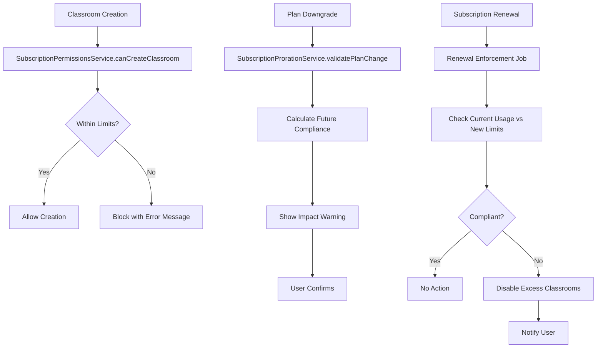

# Subscription Classroom Benefits Enforcement Implementation Plan

## 📋 Table of Contents
1. [Current State Analysis](#current-state-analysis)
2. [Vision & Requirements](#vision--requirements)
3. [Technical Architecture](#technical-architecture)
4. [Implementation Tasks](#implementation-tasks)
5. [Code Implementation Details](#code-implementation-details)
6. [Testing Strategy](#testing-strategy)
7. [Migration & Deployment](#migration--deployment)
8. [Questions for Implementation](#questions-for-implementation)

---

## 🔍 Current State Analysis

### What Works ✅

**Subscription Benefits Structure:**
- Benefits stored as JSONB in `SubscriptionPlan.benefits`
- Plan snapshot preservation in `subscription.metadata.planSnapshot`
- Classroom management benefits structure:
  ```javascript
  classroom_management: {
    enabled: boolean,
    unlimited_classrooms: boolean,
    max_classrooms: number,
    unlimited_total_students: boolean,
    max_total_students: number,
    unlimited_students_per_classroom: boolean,
    max_students_per_classroom: number
  }
  ```

**Permission Calculation:**
- `SubscriptionPermissionsService.canCreateClassroom(userId)` - Already implemented
- `SubscriptionPermissionsService.getClassroomUsage(userId)` - Already implemented
- Usage calculation via `ClassroomMembership` count queries

**Plan Change System:**
- `SubscriptionPlanChangeService` handles upgrades/downgrades
- `SubscriptionProrationService` validates plan changes
- Downgrades scheduled for next billing cycle (preserves current benefits until renewal)

### Critical Gaps 🚨

**1. Classroom Creation Bypass:**
- Route: `POST /api/entities/classroom`
- Flow: `entities.js` → `EntityService.create('classroom')`
- Problem: No subscription limit validation in creation flow
- Impact: Users can create unlimited classrooms regardless of plan

**2. Missing Downgrade Impact Analysis:**
- `SubscriptionProrationService.validatePlanChange()` only checks technical eligibility
- No calculation of usage vs. future plan limits
- No user warnings about automatic enforcement

**3. No Renewal-Time Enforcement:**
- No jobs running at subscription renewal
- No automatic disabling of excess classrooms
- No notification system for automatic changes

**4. No Reactivation Controls:**
- Disabled classrooms can be reactivated without limit checks
- No validation in classroom update flows

---

## 🎯 Vision & Requirements

### Core Principles

1. **Grace Period Approach:** Users keep current benefits until next billing cycle
2. **Transparency:** Clear warnings about future consequences of plan changes
3. **Self-Service:** Users can manually adjust before automatic enforcement
4. **Automatic Fallback:** System handles non-compliance gracefully
5. **Business Enforcement:** Limits must ultimately be respected

### User Experience Flow

**Downgrade Scenario:**
1. User requests downgrade from Premium (unlimited) to Basic (3 classrooms, 100 students)
2. System calculates: User has 8 classrooms + 150 students
3. Warning shown: "Your downgrade will take effect on [date]. You'll need to remove 5 classrooms and 50 students by then, or the system will automatically disable the oldest classrooms."
4. User confirms downgrade
5. User keeps full access until renewal date
6. On renewal: System automatically disables 5 oldest classrooms if user hasn't adjusted
7. User can manually reactivate classrooms within new limits

**Creation Scenario:**
1. User tries to create classroom
2. System checks: `canCreateClassroom(userId)`
3. If exceeds limit: Show clear error with current usage and limits
4. If within limit: Allow creation

---

## 🏗️ Technical Architecture

### Core Services Integration



### Database Impact

**No schema changes required** - Current models support all functionality:
- `Subscription.metadata.planSnapshot` - Benefits snapshot
- `Classroom.is_active` - Enable/disable mechanism
- `ClassroomMembership` - Student count tracking
- `SubscriptionPlan.benefits` - Limit definitions

### Key Integration Points

1. **Route Level:** `POST /api/entities/classroom` validation
2. **Service Level:** Enhanced validation in `SubscriptionProrationService`
3. **Job Level:** New renewal enforcement job
4. **Frontend:** Enhanced downgrade warning UI

---

## 📝 Implementation Tasks

### Phase 1: Immediate Fixes (Critical)

**Task 1.1: Add Classroom Creation Enforcement**
- File: `/routes/entities.js`
- Location: `POST /:type` handler around line 985
- Add subscription validation for `entityType === 'classroom'`

**Task 1.2: Enhanced Plan Change Validation**
- File: `/services/SubscriptionProrationService.js`
- Function: `validatePlanChange()` around line 214
- Add future compliance checking and warning generation

### Phase 2: Enforcement Infrastructure

**Task 2.1: Renewal Enforcement Job**
- File: `/services/JobScheduler.js`
- Add new job type: `SUBSCRIPTION_LIMITS_ENFORCEMENT`
- Integrate with existing subscription renewal flow

**Task 2.2: Classroom Reactivation Controls**
- File: `/routes/entities.js`
- Function: `PUT /:type/:id` handler
- Add limit validation for classroom reactivation

**Task 2.3: User Notification System**
- Service: New `SubscriptionNotificationService`
- Integration with existing notification infrastructure
- Email/in-app notifications for automatic enforcement

### Phase 3: User Experience

**Task 3.1: Enhanced Downgrade UI**
- Frontend integration (out of scope for this document)
- API enhancement for future impact calculation

**Task 3.2: Classroom Management Dashboard**
- Usage vs. limits display
- Bulk classroom management tools

---

## 💻 Code Implementation Details

### 1. Classroom Creation Enforcement

**File:** `/routes/entities.js`
**Location:** Around line 985 in `POST /:type` handler

```javascript
// Add after line 989 (after content creator permissions check)

// Special handling for classroom creation - check subscription limits
if (entityType === 'classroom') {
  const canCreate = await SubscriptionPermissionsService.canCreateClassroom(req.user.id);
  if (!canCreate.canCreate) {
    ludlog.api('[CLASSROOM-CREATE] Subscription limit exceeded', {
      userId: req.user.id,
      reason: canCreate.reason,
      current: canCreate.current,
      limit: canCreate.limit
    });

    return res.status(403).json({
      error: 'Classroom creation blocked by subscription limits',
      details: {
        reason: canCreate.reason,
        current: canCreate.current,
        limit: canCreate.limit,
        remaining: canCreate.remaining || 0
      },
      upgrade_required: true,
      message: `אינך יכול ליצור כיתה נוספת. ${canCreate.reason}. נוכחי: ${canCreate.current}/${canCreate.limit === 'unlimited' ? '∞' : canCreate.limit}`
    });
  }

  ludlog.api('[CLASSROOM-CREATE] Subscription limits validated', {
    userId: req.user.id,
    current: canCreate.current,
    limit: canCreate.limit,
    remaining: canCreate.remaining
  });
}
```

### 2. Future Compliance Checking

**File:** `/services/SubscriptionProrationService.js`
**Location:** Add new function after line 303

```javascript
/**
 * Check if user's current usage will comply with new plan limits
 * @param {Object} currentSubscription - Current subscription
 * @param {Object} newPlan - Target plan
 * @param {string} userId - User ID
 * @returns {Promise<Object>} Compliance analysis
 */
static async checkFutureCompliance(currentSubscription, newPlan, userId) {
  try {
    // Get current classroom usage
    const usage = await SubscriptionPermissionsService.getClassroomUsage(userId);

    // Extract new plan limits
    const newLimits = newPlan.benefits?.classroom_management;
    if (!newLimits || !newLimits.enabled) {
      return {
        compliant: false,
        reason: 'New plan does not include classroom management',
        willLoseAccess: true,
        excessClassrooms: usage.current_classrooms,
        excessStudents: usage.current_students_total
      };
    }

    // Check classroom limit compliance
    let excessClassrooms = 0;
    if (!newLimits.unlimited_classrooms) {
      excessClassrooms = Math.max(0, usage.current_classrooms - newLimits.max_classrooms);
    }

    // Check total students limit compliance
    let excessStudents = 0;
    if (!newLimits.unlimited_total_students) {
      excessStudents = Math.max(0, usage.current_students_total - newLimits.max_total_students);
    }

    const compliant = excessClassrooms === 0 && excessStudents === 0;

    return {
      compliant,
      excessClassrooms,
      excessStudents,
      newLimits: {
        classrooms: newLimits.unlimited_classrooms ? 'unlimited' : newLimits.max_classrooms,
        students: newLimits.unlimited_total_students ? 'unlimited' : newLimits.max_total_students
      },
      effectiveDate: currentSubscription.next_billing_date,
      message: compliant
        ? 'Current usage is within new plan limits'
        : `תצטרך להסיר ${excessClassrooms} כיתות ו-${excessStudents} תלמידים עד ל-${new Date(currentSubscription.next_billing_date).toLocaleDateString('he-IL')}`
    };

  } catch (error) {
    luderror.payments('Error checking future compliance:', error);
    return {
      compliant: false,
      error: error.message
    };
  }
}
```

**Update:** `validatePlanChange()` function around line 214

```javascript
// Add after existing validation (around line 280)

// Check future compliance for downgrades
if (changeType === 'downgrade') {
  const complianceCheck = await this.checkFutureCompliance(currentSubscription, newPlan, currentSubscription.user_id);

  if (!complianceCheck.compliant && !complianceCheck.error) {
    return {
      valid: true, // Allow downgrade but require confirmation
      requiresConfirmation: true,
      changeType,
      futureCompliance: complianceCheck,
      warning: {
        title: 'השינוי ישפיע על הכיתות שלך',
        message: complianceCheck.message,
        details: {
          excessClassrooms: complianceCheck.excessClassrooms,
          excessStudents: complianceCheck.excessStudents,
          effectiveDate: complianceCheck.effectiveDate,
          newLimits: complianceCheck.newLimits
        },
        actions: [
          'הסר כיתות עודפות לפני תאריך החידוש',
          'או המערכת תשבית אוטומטית את הכיתות הישנות ביותר',
          'תוכל להפעיל מחדש כיתות במסגרת המגבלות החדשות'
        ]
      }
    };
  }
}
```

### 3. Renewal Enforcement Job

**File:** `/services/JobScheduler.js`
**Location:** Add to job processors around line 200

```javascript
/**
 * Enforce subscription limits on renewal
 */
async processSubscriptionLimitsEnforcement(data) {
  const { subscriptionId, enforcementType = 'classroom_limits' } = data;

  try {
    ludlog.generic('Processing subscription limits enforcement', {
      subscriptionId,
      enforcementType
    });

    const subscription = await models.Subscription.findOne({
      where: { id: subscriptionId },
      include: [{
        model: models.SubscriptionPlan,
        as: 'subscriptionPlan'
      }]
    });

    if (!subscription) {
      throw new Error(`Subscription ${subscriptionId} not found`);
    }

    if (enforcementType === 'classroom_limits') {
      await this.enforceClassroomLimits(subscription);
    }

    return { success: true, subscriptionId, enforcementType };

  } catch (error) {
    luderror.generic('Subscription limits enforcement failed:', error);
    throw error;
  }
}

/**
 * Enforce classroom limits for a subscription
 */
async enforceClassroomLimits(subscription) {
  const userId = subscription.user_id;
  const limits = subscription.subscriptionPlan.benefits?.classroom_management;

  if (!limits || !limits.enabled) {
    ludlog.generic('No classroom limits to enforce', {
      subscriptionId: subscription.id,
      planName: subscription.subscriptionPlan.name
    });
    return;
  }

  // Get current usage
  const usage = await models.sequelize.query(`
    SELECT
      COUNT(*) as classroom_count,
      COALESCE(SUM(student_counts.student_count), 0) as total_students
    FROM classroom c
    LEFT JOIN (
      SELECT
        classroom_id,
        COUNT(*) as student_count
      FROM classroommembership
      WHERE status = 'active'
      GROUP BY classroom_id
    ) student_counts ON c.id = student_counts.classroom_id
    WHERE c.teacher_id = :userId AND c.is_active = true
  `, {
    replacements: { userId },
    type: models.sequelize.QueryTypes.SELECT
  });

  const currentUsage = usage[0];
  let enforcements = [];

  // Check classroom limit
  if (!limits.unlimited_classrooms && currentUsage.classroom_count > limits.max_classrooms) {
    const excessCount = currentUsage.classroom_count - limits.max_classrooms;

    ludlog.generic('Enforcing classroom limit', {
      userId,
      currentCount: currentUsage.classroom_count,
      limit: limits.max_classrooms,
      toDisable: excessCount
    });

    // Disable oldest classrooms first
    const classroomsToDisable = await models.Classroom.findAll({
      where: {
        teacher_id: userId,
        is_active: true
      },
      order: [['created_at', 'ASC']],
      limit: excessCount
    });

    for (const classroom of classroomsToDisable) {
      await classroom.update({
        is_active: false,
        disabled_reason: 'subscription_limit_exceeded',
        disabled_at: new Date()
      });

      enforcements.push({
        type: 'classroom_disabled',
        classroomId: classroom.id,
        classroomName: classroom.name
      });
    }
  }

  // TODO: Add student limit enforcement if needed

  // Notify user of enforcements
  if (enforcements.length > 0) {
    await this.notifyUserOfEnforcements(userId, subscription, enforcements);
  }

  return enforcements;
}

/**
 * Notify user about automatic enforcements
 */
async notifyUserOfEnforcements(userId, subscription, enforcements) {
  // Import notification service dynamically to avoid circular dependencies
  const NotificationService = (await import('./NotificationService.js')).default;

  const classroomsDisabled = enforcements.filter(e => e.type === 'classroom_disabled');

  if (classroomsDisabled.length > 0) {
    const message = `המנוי שלך עודכן ל-${subscription.subscriptionPlan.name}. ` +
      `${classroomsDisabled.length} כיתות הושבתו אוטומטית כדי לעמוד במגבלות החדשות. ` +
      `תוכל להפעיל מחדש כיתות במסגרת המגבלות החדשות.`;

    await NotificationService.notify(userId, {
      type: 'subscription_enforcement',
      title: 'כיתות הושבתו בעקבות שינוי מנוי',
      message,
      data: {
        subscriptionId: subscription.id,
        planName: subscription.subscriptionPlan.name,
        enforcements
      }
    });
  }
}
```

**Integration:** Add job scheduling in subscription renewal flow

**File:** Existing subscription renewal service
**Location:** After subscription plan change is applied

```javascript
// Schedule limits enforcement job
await jobScheduler.scheduleJob('SUBSCRIPTION_LIMITS_ENFORCEMENT', {
  subscriptionId: subscription.id,
  enforcementType: 'classroom_limits'
}, {
  delay: 1000, // Run after 1 second
  priority: 80  // High priority
});
```

### 4. Classroom Reactivation Controls

**File:** `/routes/entities.js`
**Location:** `PUT /:type/:id` handler around line 1200

```javascript
// Add special handling for classroom reactivation
if (entityType === 'classroom' && req.body.is_active === true) {
  // Check if classroom was previously active
  const currentClassroom = await EntityService.find(entityType, { id: req.params.id, creator_user_id: req.user.id })[0];

  if (currentClassroom && !currentClassroom.is_active) {
    // This is a reactivation - check subscription limits
    const canCreate = await SubscriptionPermissionsService.canCreateClassroom(req.user.id);
    if (!canCreate.canCreate) {
      ludlog.api('[CLASSROOM-REACTIVATE] Subscription limit exceeded', {
        userId: req.user.id,
        classroomId: req.params.id,
        reason: canCreate.reason,
        current: canCreate.current,
        limit: canCreate.limit
      });

      return res.status(403).json({
        error: 'Cannot reactivate classroom due to subscription limits',
        details: {
          reason: canCreate.reason,
          current: canCreate.current,
          limit: canCreate.limit
        },
        message: `לא ניתן להפעיל מחדש את הכיתה. ${canCreate.reason}. נוכחי: ${canCreate.current}/${canCreate.limit === 'unlimited' ? '∞' : canCreate.limit}`
      });
    }

    ludlog.api('[CLASSROOM-REACTIVATE] Subscription limits validated for reactivation', {
      userId: req.user.id,
      classroomId: req.params.id,
      current: canCreate.current,
      limit: canCreate.limit
    });
  }
}
```

---

## 🧪 Testing Strategy

### Unit Tests

**Test File:** `/tests/unit/subscriptionEnforcement.test.js`

```javascript
describe('Subscription Classroom Enforcement', () => {

  describe('Classroom Creation Limits', () => {
    test('should block creation when limit exceeded', async () => {
      // Setup user with Basic plan (3 classrooms)
      // Create 3 classrooms
      // Attempt to create 4th classroom
      // Expect 403 error with specific message
    });

    test('should allow creation within limits', async () => {
      // Setup user with Basic plan (3 classrooms)
      // Create 2 classrooms
      // Attempt to create 3rd classroom
      // Expect success
    });
  });

  describe('Future Compliance Checking', () => {
    test('should detect excess classrooms on downgrade', async () => {
      // Setup user with Premium plan, 8 classrooms
      // Check compliance with Basic plan (3 classrooms)
      // Expect excessClassrooms: 5
    });

    test('should allow downgrade when compliant', async () => {
      // Setup user with Premium plan, 2 classrooms
      // Check compliance with Basic plan (3 classrooms)
      // Expect compliant: true
    });
  });

  describe('Renewal Enforcement', () => {
    test('should disable excess classrooms on renewal', async () => {
      // Setup subscription renewal with excess classrooms
      // Run enforcement job
      // Verify oldest classrooms are disabled
    });

    test('should not affect compliant subscriptions', async () => {
      // Setup subscription renewal within limits
      // Run enforcement job
      // Verify no classrooms disabled
    });
  });
});
```

### Integration Tests

**Test File:** `/tests/integration/classroomLimitsFlow.test.js`

```javascript
describe('End-to-End Classroom Limits Flow', () => {
  test('complete downgrade and enforcement flow', async () => {
    // 1. Create user with Premium plan
    // 2. Create 8 classrooms with students
    // 3. Request downgrade to Basic
    // 4. Verify warning shows excess counts
    // 5. Confirm downgrade
    // 6. Simulate renewal date
    // 7. Run enforcement job
    // 8. Verify 5 classrooms disabled
    // 9. Attempt reactivation within limits
    // 10. Verify success
    // 11. Attempt reactivation beyond limits
    // 12. Verify blocked
  });
});
```

### Manual Testing Scenarios

1. **Classroom Creation Flow:**
   - User at limit tries to create classroom
   - User below limit creates classroom successfully
   - User with unlimited plan creates multiple classrooms

2. **Downgrade Warning Flow:**
   - User with excess usage requests downgrade
   - Warning displays correct numbers
   - User can confirm despite warning

3. **Enforcement Flow:**
   - Subscription renews with plan change
   - Excess classrooms are disabled
   - User receives notification
   - User can reactivate within limits

---

## 📦 Migration & Deployment

### Pre-Deployment Checklist

1. **Database Backup:** Ensure recent backup before deployment
2. **Existing Data Audit:**
   ```sql
   -- Check users with potential compliance issues
   SELECT
     u.id, u.email,
     sp.name as plan_name,
     sp.benefits->'classroom_management'->>'max_classrooms' as limit,
     COUNT(c.id) as current_classrooms
   FROM users u
   JOIN subscription s ON s.user_id = u.id AND s.status = 'active'
   JOIN subscriptionplan sp ON sp.id = s.subscription_plan_id
   JOIN classroom c ON c.teacher_id = u.id AND c.is_active = true
   GROUP BY u.id, u.email, sp.name, sp.benefits
   HAVING COUNT(c.id) > (sp.benefits->'classroom_management'->>'max_classrooms')::int
   ```

3. **Feature Flags:** Consider adding feature flags for gradual rollout
4. **Monitoring:** Set up alerts for enforcement job failures

### Deployment Steps

1. **Deploy Code Changes:**
   - Routes enforcement (immediate effect)
   - Service enhancements (immediate effect)
   - Job scheduler updates (immediate effect)

2. **Enable Enforcement:**
   - Start with new classroom creations
   - Enable downgrade warnings
   - Enable renewal enforcement (may want delay)

3. **Monitor & Adjust:**
   - Watch for user complaints
   - Monitor error rates
   - Adjust messaging based on feedback

### Rollback Plan

1. **Emergency Rollback:** Remove validation checks from routes
2. **Graceful Rollback:** Add feature flag to bypass enforcement
3. **Data Recovery:** Re-enable any incorrectly disabled classrooms

---

## ❓ Questions for Implementation

### Business Logic Questions

1. **Enforcement Timing:**
   - Should enforcement run immediately on renewal or have a grace period?
   - How long should users have to manually comply?

2. **Classroom Selection:**
   - When disabling excess classrooms, use oldest creation date?
   - Or consider other factors (least students, last activity, etc.)?

3. **Student Impact:**
   - What happens to students in disabled classrooms?
   - Should they be notified? Should memberships be preserved?

4. **Edge Cases:**
   - What if user upgrades during grace period?
   - What if PayPlus fails but local renewal succeeds?
   - What if user deletes account with pending enforcement?

### Technical Questions

1. **Performance:**
   - Should usage calculations be cached?
   - How to handle concurrent classroom creation attempts?

2. **Notification System:**
   - Email, in-app, or both for enforcement notifications?
   - What's the existing notification infrastructure?

3. **Monitoring:**
   - What metrics should be tracked?
   - What alerts are needed?

### User Experience Questions

1. **Messaging:**
   - Hebrew translations for all error messages?
   - What level of detail in warnings?

2. **Recovery Flow:**
   - Should there be bulk reactivation tools?
   - Should users get recommendations on which classrooms to keep?

3. **Support:**
   - What should support team know about this system?
   - Any override capabilities needed?

---

## 📋 Implementation Checklist

### Before Starting
- [ ] Review current codebase state
- [ ] Confirm all questions above are answered
- [ ] Set up development environment with test data
- [ ] Create feature branch: `feature/classroom-limits-enforcement`

### Phase 1: Critical Fixes
- [ ] Implement classroom creation enforcement
- [ ] Add future compliance checking
- [ ] Update plan change validation
- [ ] Test basic enforcement flow

### Phase 2: Infrastructure
- [ ] Implement renewal enforcement job
- [ ] Add classroom reactivation controls
- [ ] Create notification system integration
- [ ] Test complete enforcement cycle

### Phase 3: Polish & Deploy
- [ ] Add comprehensive error handling
- [ ] Implement monitoring and alerts
- [ ] Complete test suite
- [ ] Deploy with feature flags
- [ ] Monitor and iterate

---

## 📚 Related Files & Documentation

### Key Files to Modify
- `/routes/entities.js` - Classroom creation enforcement
- `/services/SubscriptionProrationService.js` - Plan change validation
- `/services/JobScheduler.js` - Renewal enforcement
- `/services/SubscriptionPermissionsService.js` - May need enhancements

### Dependencies
- Existing subscription system
- Job scheduler infrastructure
- Notification system
- Current user permission system

### Documentation to Update
- API documentation for error responses
- User-facing documentation about limits
- Support team documentation about enforcement
- Developer documentation about subscription system

---

**Last Updated:** December 12, 2025
**Implementation Status:** Planning Phase
**Assigned To:** TBD
**Priority:** High - Critical business logic gap

> 🚨 **Important:** Always verify current codebase state matches this analysis before implementing. Subscription systems are critical business infrastructure - test thoroughly before deployment.