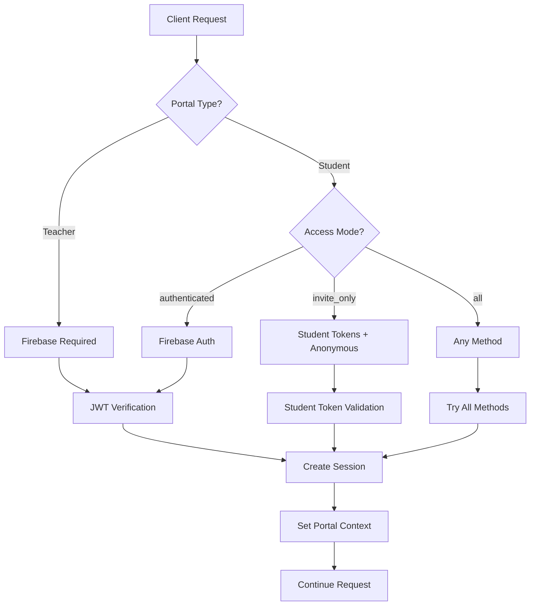

# Ludora Authentication Flow Reference

> **Technical reference for Ludora's multi-portal, multi-method authentication system**

## Table of Contents

1. [Architecture Overview](#architecture-overview)
2. [Authentication Methods](#authentication-methods)
3. [Portal-Specific Authentication](#portal-specific-authentication)
4. [Session Management](#session-management)
5. [Middleware Integration](#middleware-integration)
6. [Socket.IO Authentication](#socketio-authentication)
7. [Student Access Modes](#student-access-modes)
8. [Error Handling](#error-handling)
9. [Security Considerations](#security-considerations)

---

## Architecture Overview

Ludora implements a **sophisticated multi-portal authentication system** supporting:

- **Teacher Portal**: Firebase Authentication (required)
- **Student Portal**: Firebase + Student Access Tokens + Anonymous (configurable)
- **Real-time**: Socket.IO with portal-aware authentication
- **Security**: Database-backed session persistence + rate limiting

### Authentication Flow Diagram



---

## Authentication Methods

### 1. Firebase Authentication (Primary)

**Used for**: Teachers (required), Students (optional)

```javascript
// Client-side Firebase auth
import { signInWithEmailAndPassword } from 'firebase/auth';

const credential = await signInWithEmailAndPassword(auth, email, password);
const idToken = await credential.user.getIdToken();

// API request with Firebase token
const response = await fetch('/api/entities', {
  headers: {
    'Authorization': `Bearer ${idToken}`,
    'Content-Type': 'application/json'
  }
});
```

**Backend verification:**
```javascript
// middleware/auth.js - Firebase token verification
import { admin } from '../config/firebase.js';

export async function verifyFirebaseToken(token) {
  try {
    const decodedToken = await admin.auth().verifyIdToken(token);
    return {
      id: decodedToken.uid,
      email: decodedToken.email,
      role: decodedToken.role || 'student',
      type: 'firebase_user'
    };
  } catch (error) {
    throw new Error('Invalid Firebase token');
  }
}
```

### 2. Student Access Tokens (Player System)

**Used for**: Students in educational sessions

```javascript
// Generated by teacher invitation system
const playerTokens = {
  access: 'eyJhbGciOiJIUzI1NiIsInR5cCI6IkpXVCJ9...',  // Short-lived (24h)
  refresh: 'eyJhbGciOiJIUzI1NiIsInR5cCI6IkpXVCJ9...' // Long-lived (30 days)
};

// Automatic cookie-based authentication
const response = await fetch('/api/games/join', {
  credentials: 'include', // Includes student_access_token cookie
  headers: {
    'Content-Type': 'application/json'
  }
});
```

**Backend verification:**
```javascript
// services/PlayerService.js - Player token verification
export async function verifyPlayerToken(token) {
  const payload = jwt.verify(token, process.env.JWT_SECRET);

  if (payload.type !== 'player') {
    throw new Error('Invalid player token');
  }

  const player = await models.Player.findByPk(payload.id);
  return {
    player_id: player.id,
    display_name: player.display_name,
    teacher_id: player.teacher_id,
    type: 'player'
  };
}
```

### 3. Anonymous Access

**Used for**: Student portal in invite-only mode

```javascript
// No authentication required for specific endpoints
const response = await fetch('/api/games/join', {
  method: 'POST',
  headers: {
    'Content-Type': 'application/json'
  },
  body: JSON.stringify({
    lobby_code: '123456',
    display_name: 'Anonymous Player'
  })
});
```

---

## Portal-Specific Authentication

### Teacher Portal Authentication

**Requirements**: Firebase authentication (mandatory)

```javascript
// routes/auth.js - Teacher authentication middleware
export const requireTeacherAuth = [
  authenticateToken,           // Verify Firebase token
  requirePortalType('teacher'), // Ensure teacher portal
  validateUserRole(['teacher', 'admin'])
];

router.get('/api/entities/game', requireTeacherAuth, async (req, res) => {
  // req.user contains Firebase user data
  const games = await EntityService.find('game', {
    creator_user_id: req.user.id
  });
  res.json(games);
});
```

### Student Portal Authentication

**Flexible multi-method authentication:**

```javascript
// middleware/studentAuth.js - Flexible student authentication
export const authenticateUserOrPlayer = async (req, res, next) => {
  try {
    // Method 1: Try Firebase authentication
    if (req.headers.authorization) {
      const token = req.headers.authorization.split(' ')[1];
      const userData = await verifyFirebaseToken(token);
      req.user = userData;
      req.authMethod = 'firebase';
      return next();
    }

    // Method 2: Try student access tokens
    const studentToken = req.cookies.student_access_token;
    if (studentToken) {
      const playerData = await verifyPlayerToken(studentToken);
      req.player = playerData;
      req.authMethod = 'student_access_token';
      return next();
    }

    // Method 3: Check if anonymous access allowed
    const studentsAccess = await SettingsService.get('students_access');
    if (['invite_only', 'all'].includes(studentsAccess)) {
      req.authMethod = 'anonymous';
      return next();
    }

    // No valid authentication method
    return res.status(401).json({
      error: 'Authentication required',
      supportedMethods: ['firebase', 'student_tokens', 'anonymous']
    });

  } catch (error) {
    return res.status(401).json({
      error: 'Authentication failed',
      message: error.message
    });
  }
};
```

---

## Session Management

### Database-Backed Sessions

**CRITICAL**: Ludora uses full database persistence for sessions (no in-memory storage)

```javascript
// models/UserSession.js - Persistent session model
class UserSession extends Model {
  static associate(models) {
    UserSession.belongsTo(models.User, {
      foreignKey: 'user_id',
      as: 'user'
    });
  }

  // Instance methods for session management
  isActive() {
    return this.is_active && new Date() < new Date(this.expires_at);
  }

  async updateLastAccessed() {
    this.last_accessed_at = new Date();
    await this.save();
  }

  async invalidate() {
    this.is_active = false;
    this.invalidated_at = new Date();
    await this.save();
  }
}
```

### Session Lifecycle

```javascript
// services/AuthService.js - Session management
class AuthService {
  async createSession(userId, metadata = {}) {
    const sessionId = crypto.randomUUID();

    const session = await models.UserSession.create({
      id: sessionId,
      user_id: userId,
      expires_at: new Date(Date.now() + 24 * 60 * 60 * 1000), // 24 hours
      is_active: true,
      metadata: {
        userAgent: metadata.userAgent,
        ipAddress: metadata.ipAddress,
        loginMethod: metadata.loginMethod || 'firebase'
      }
    });

    return session.id;
  }

  async validateSession(sessionId) {
    const session = await models.UserSession.findOne({
      where: {
        id: sessionId,
        is_active: true
      },
      include: [{
        model: models.User,
        as: 'user'
      }]
    });

    if (!session || !session.isActive()) {
      return null;
    }

    // Update last accessed
    await session.updateLastAccessed();

    return session;
  }

  async invalidateSession(sessionId) {
    const session = await models.UserSession.findByPk(sessionId);
    if (session) {
      await session.invalidate();
    }
  }

  async invalidateUserSessions(userId) {
    return await models.UserSession.update({
      is_active: false,
      invalidated_at: new Date()
    }, {
      where: {
        user_id: userId,
        is_active: true
      }
    });
  }
}
```

---

## Middleware Integration

### Authentication Chain

```javascript
// middleware/auth.js - Complete authentication middleware chain
export const authenticateToken = async (req, res, next) => {
  try {
    // Extract token from header
    const authHeader = req.headers.authorization;
    const token = authHeader && authHeader.split(' ')[1];

    if (!token) {
      return res.status(401).json({
        error: 'Access token required',
        code: 'MISSING_TOKEN'
      });
    }

    // Verify Firebase token
    const userData = await verifyFirebaseToken(token);

    // Create or update session
    const sessionId = await authService.createSession(userData.id, {
      userAgent: req.headers['user-agent'],
      ipAddress: req.ip,
      loginMethod: 'firebase'
    });

    // Attach user data and session to request
    req.user = userData;
    req.sessionId = sessionId;
    req.authMethod = 'firebase';

    next();

  } catch (error) {
    return res.status(401).json({
      error: 'Invalid or expired token',
      code: 'INVALID_TOKEN',
      details: error.message
    });
  }
};
```

### Portal Detection

```javascript
// middleware/portalDetection.js - Portal context detection
export const detectPortal = (req, res, next) => {
  const origin = req.headers.origin || '';
  const referer = req.headers.referer || '';
  const userAgent = req.headers['user-agent'] || '';

  // Student portal indicators
  const isStudentPortal = [
    origin.includes('my.ludora.app'),
    referer.includes('my.ludora.app'),
    origin.includes('localhost:5174'),
    referer.includes('localhost:5174'),
    req.headers['x-portal-type'] === 'student'
  ].some(Boolean);

  req.portalContext = {
    type: isStudentPortal ? 'student' : 'teacher',
    origin,
    referer,
    userAgent,
    detected: true
  };

  next();
};
```

---

## Socket.IO Authentication

### Portal-Aware WebSocket Authentication

```javascript
// index.js - Socket.IO authentication middleware
io.use(async (socket, next) => {
  try {
    // Parse portal context from handshake
    const portalContext = parseSocketPortalContext(socket);
    const { portalType, credentialPolicy } = portalContext;

    // Initialize socket context
    socket.portalContext = portalContext;
    socket.isAuthenticated = false;
    socket.user = null;
    socket.player = null;

    switch (credentialPolicy) {
      case 'with_credentials':
        // Firebase auth required
        const userData = await authenticateSocketWithFirebase(socket, portalType);
        if (userData) {
          Object.assign(socket, {
            isAuthenticated: true,
            user: userData,
            authMethod: 'firebase'
          });
        } else {
          return next(new Error('Authentication required'));
        }
        break;

      case 'without_credentials':
        // Anonymous allowed (student portal only)
        if (portalType === 'teacher') {
          return next(new Error('Teacher portal requires authentication'));
        }
        Object.assign(socket, {
          authMethod: 'anonymous',
          isAuthenticated: false
        });
        break;

      case 'try_both':
        // Try Firebase first, then player tokens, then anonymous
        const firebaseUser = await authenticateSocketWithFirebase(socket, portalType);
        if (firebaseUser) {
          Object.assign(socket, {
            isAuthenticated: true,
            user: firebaseUser,
            authMethod: 'firebase'
          });
        } else {
          const playerData = await authenticateSocketWithPlayerTokens(socket);
          if (playerData) {
            Object.assign(socket, {
              player: playerData,
              authMethod: 'student_access_token',
              isAuthenticated: true
            });
          } else if (portalType === 'student') {
            Object.assign(socket, {
              authMethod: 'anonymous',
              isAuthenticated: false
            });
          } else {
            return next(new Error('Teacher portal requires authentication'));
          }
        }
        break;
    }

    next();

  } catch (error) {
    next(new Error('Authentication failed'));
  }
});
```

### Socket Authentication Methods

```javascript
// Socket.IO Firebase authentication
async function authenticateSocketWithFirebase(socket, portalType) {
  const cookieHeader = socket.handshake.headers.cookie || '';
  const cookies = cookie.parse(cookieHeader);

  const cookieNames = getPortalCookieNames(portalType);
  const accessToken = cookies[cookieNames.accessToken];

  if (!accessToken) return null;

  try {
    return await authService.verifyToken(accessToken);
  } catch (error) {
    return null;
  }
}

// Socket.IO player token authentication
async function authenticateSocketWithPlayerTokens(socket) {
  const cookieHeader = socket.handshake.headers.cookie || '';
  const cookies = cookie.parse(cookieHeader);

  const playerToken = cookies.student_access_token;
  if (!playerToken) return null;

  try {
    const tokenData = await authService.verifyToken(playerToken);
    if (tokenData.type === 'player') {
      const player = await PlayerService.getPlayer(tokenData.id);
      return { player, sessionType: 'player_token' };
    }
  } catch (error) {
    return null;
  }

  return null;
}
```

---

## Student Access Modes

### Settings-Based Access Control

```javascript
// Student access modes (configurable via Settings)
const STUDENT_ACCESS_MODES = {
  INVITE_ONLY: 'invite_only',    // Requires lobby codes or teacher invitations
  AUTHED_ONLY: 'authed_only',   // Requires authentication (Firebase or student tokens)
  ALL: 'all'                    // Allows anonymous access
};

// Dynamic access mode checking
async function checkStudentAccessMode(requiredMode, userAuthData) {
  const currentMode = await SettingsService.get('students_access');

  switch (currentMode) {
    case 'invite_only':
      // Check for lobby code or invitation code
      return userAuthData.lobby_code || userAuthData.invitation_code;

    case 'authed_only':
      // Requires some form of authentication
      return userAuthData.isAuthenticated;

    case 'all':
      // Always allow
      return true;

    default:
      // Default to most restrictive
      return false;
  }
}
```

### Parent Consent System

**Israeli Privacy Law Compliance:**

```javascript
// middleware/consentEnforcement.js - Parental consent checking
export const requireStudentConsent = async (req, res, next) => {
  try {
    // Only apply to student portal requests
    if (req.portalContext?.type !== 'student') {
      return next();
    }

    // Only apply if consent is required by settings
    const consentRequired = await SettingsService.get('parent_consent_required');
    if (!consentRequired) {
      return next();
    }

    // Check if user is authenticated and get their age/consent status
    if (req.user) {
      const consentStatus = await models.ParentConsent.findOne({
        where: {
          student_user_id: req.user.id,
          consent_revoked_at: null
        }
      });

      if (!consentStatus) {
        return res.status(403).json({
          error: 'Parental consent required',
          code: 'CONSENT_REQUIRED',
          details: {
            message: 'This account requires parental consent to access educational content',
            consentUrl: '/api/auth/parent-consent'
          }
        });
      }
    }

    next();

  } catch (error) {
    return res.status(500).json({
      error: 'Consent verification failed',
      code: 'CONSENT_CHECK_ERROR'
    });
  }
};
```

---

## Error Handling

### Authentication Error Codes

```javascript
// Standard authentication error responses
const AUTH_ERRORS = {
  MISSING_TOKEN: {
    status: 401,
    code: 'MISSING_TOKEN',
    message: 'Authentication token required'
  },
  INVALID_TOKEN: {
    status: 401,
    code: 'INVALID_TOKEN',
    message: 'Invalid or expired authentication token'
  },
  EXPIRED_TOKEN: {
    status: 401,
    code: 'EXPIRED_TOKEN',
    message: 'Authentication token has expired'
  },
  INSUFFICIENT_PERMISSIONS: {
    status: 403,
    code: 'INSUFFICIENT_PERMISSIONS',
    message: 'Insufficient permissions for this action'
  },
  PORTAL_MISMATCH: {
    status: 403,
    code: 'PORTAL_MISMATCH',
    message: 'Authentication method not valid for this portal'
  },
  CONSENT_REQUIRED: {
    status: 403,
    code: 'CONSENT_REQUIRED',
    message: 'Parental consent required for student account'
  },
  RATE_LIMITED: {
    status: 429,
    code: 'RATE_LIMITED',
    message: 'Too many authentication attempts'
  }
};

// Error response formatter
function formatAuthError(errorCode, additionalDetails = {}) {
  const baseError = AUTH_ERRORS[errorCode];
  return {
    error: {
      ...baseError,
      details: additionalDetails,
      timestamp: new Date().toISOString()
    }
  };
}
```

### Client-Side Error Handling

```javascript
// Frontend authentication error handling
async function handleAuthError(error) {
  switch (error.code) {
    case 'MISSING_TOKEN':
    case 'INVALID_TOKEN':
    case 'EXPIRED_TOKEN':
      // Redirect to login
      redirectToLogin();
      break;

    case 'PORTAL_MISMATCH':
      // Switch to correct portal
      redirectToCorrectPortal(error.details.expectedPortal);
      break;

    case 'CONSENT_REQUIRED':
      // Show consent dialog
      showParentConsentDialog(error.details.consentUrl);
      break;

    case 'RATE_LIMITED':
      // Show rate limit message
      const retryAfter = error.details.retryAfter || 60;
      showRateLimitMessage(`Please wait ${retryAfter} seconds before trying again`);
      break;

    default:
      // Generic error
      showGenericAuthError(error.message);
  }
}
```

---

## Security Considerations

### Token Security

```javascript
// Secure token handling practices
const TOKEN_SECURITY = {
  // Refresh token rotation
  REFRESH_TOKEN_ROTATION: true,

  // Token expiration times
  ACCESS_TOKEN_EXPIRY: '24h',
  REFRESH_TOKEN_EXPIRY: '30d',
  SESSION_EXPIRY: '24h',

  // Secure cookie settings
  COOKIE_SETTINGS: {
    httpOnly: true,
    secure: process.env.NODE_ENV === 'production',
    sameSite: 'lax',
    maxAge: 24 * 60 * 60 * 1000 // 24 hours
  }
};
```

### Rate Limiting

```javascript
// Authentication-specific rate limiting
const authRateLimit = rateLimit({
  windowMs: 15 * 60 * 1000, // 15 minutes
  max: 10, // 10 attempts per window
  message: {
    error: 'Too many authentication attempts',
    code: 'AUTH_RATE_LIMITED',
    retryAfter: Math.ceil(900) // seconds
  },
  standardHeaders: true,
  legacyHeaders: false
});

// Apply to authentication endpoints
app.use('/api/auth', authRateLimit);
```

### Session Security

```javascript
// Session hijacking prevention
export const validateSessionSecurity = async (req, res, next) => {
  if (!req.sessionId) return next();

  try {
    const session = await models.UserSession.findByPk(req.sessionId);

    if (session) {
      // Check for suspicious activity
      const metadata = session.metadata;
      const currentUserAgent = req.headers['user-agent'];
      const currentIP = req.ip;

      // User agent validation
      if (metadata.userAgent && metadata.userAgent !== currentUserAgent) {
        await session.invalidate();
        return res.status(401).json({
          error: 'Session security violation: User agent mismatch',
          code: 'SESSION_SECURITY_VIOLATION'
        });
      }

      // IP change detection (warn but don't block)
      if (metadata.ipAddress && metadata.ipAddress !== currentIP) {
        await models.SecurityLog.create({
          user_id: session.user_id,
          event_type: 'ip_change',
          old_ip: metadata.ipAddress,
          new_ip: currentIP,
          session_id: session.id
        });
      }
    }

    next();

  } catch (error) {
    next(error);
  }
};
```

---

## Authentication Flow Examples

### Complete Teacher Authentication

```javascript
// 1. Firebase login
const credential = await signInWithEmailAndPassword(auth, email, password);
const idToken = await credential.user.getIdToken();

// 2. API request with token
const response = await fetch('/api/entities/game', {
  headers: {
    'Authorization': `Bearer ${idToken}`,
    'Content-Type': 'application/json',
    'X-Portal-Type': 'teacher'
  }
});

// 3. Backend processing
// - Token verified via Firebase Admin SDK
// - User session created in database
// - Portal context set to 'teacher'
// - Request processed with full authentication
```

### Complete Student Authentication

```javascript
// Scenario 1: Authenticated student
const firebaseToken = await student.getIdToken();
const response = await fetch('/api/games', {
  headers: {
    'Authorization': `Bearer ${firebaseToken}`,
    'X-Portal-Type': 'student'
  }
});

// Scenario 2: Student with access tokens
const response = await fetch('/api/games/join', {
  method: 'POST',
  credentials: 'include', // Includes student_access_token cookie
  headers: {
    'Content-Type': 'application/json',
    'X-Portal-Type': 'student'
  },
  body: JSON.stringify({
    lobby_code: '123456',
    display_name: 'Student Name'
  })
});

// Scenario 3: Anonymous student
const response = await fetch('/api/games/join', {
  method: 'POST',
  headers: {
    'Content-Type': 'application/json',
    'X-Portal-Type': 'student'
  },
  body: JSON.stringify({
    lobby_code: '123456',
    display_name: 'Anonymous Player'
  })
});
```

---

This authentication reference provides complete technical documentation for implementing and integrating with Ludora's sophisticated authentication system. For implementation examples, see the [API Integration Guide](./API_INTEGRATION_GUIDE.md).