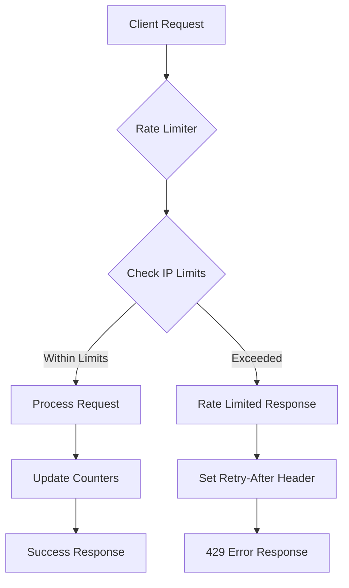

# Ludora API Rate Limiting Guide

> **Comprehensive guide to rate limiting policies, handling strategies, and optimization techniques**

## Table of Contents

1. [Rate Limiting Overview](#rate-limiting-overview)
2. [Rate Limit Policies](#rate-limit-policies)
3. [Response Headers](#response-headers)
4. [Handling Rate Limits](#handling-rate-limits)
5. [Optimization Strategies](#optimization-strategies)
6. [Monitoring and Analytics](#monitoring-and-analytics)
7. [Best Practices](#best-practices)
8. [Troubleshooting](#troubleshooting)

---

## Rate Limiting Overview

Ludora implements **sophisticated IP-based rate limiting** to ensure API stability and fair usage across all users and integrations.

### Key Features

- **Per-IP tracking** using express-rate-limit
- **Different limits** for different endpoint categories
- **Graceful degradation** with informative error messages
- **Development bypass** for testing and development
- **Production security** with strict enforcement

### Rate Limiting Architecture



---

## Rate Limit Policies

### Current Rate Limits

| Category | Endpoint Pattern | Limit | Window | Purpose |
|----------|------------------|-------|---------|---------|
| **Global** | `/api/*` | 1000 requests | 15 minutes | Overall API protection |
| **Authentication** | `/api/auth/*` | 10 attempts | 15 minutes | Prevent brute force attacks |
| **File Upload** | `/api/assets/*`, `/api/v2/assets/*` | 50 uploads | 15 minutes | Prevent resource exhaustion |
| **Email** | `/api/email/*` | 200 emails | 1 hour | Prevent spam |
| **SSE Connections** | `/api/sse/*` | 100 connections | 1 minute | Prevent connection flooding |
| **Game Creation** | `POST /api/entities/game` | 20 games | 15 minutes | Prevent content spam |

### Rate Limit Configuration

```javascript
// middleware/validation.js - Rate limit configuration
const rateLimit = require('express-rate-limit');

export const rateLimiters = {
  // Global API rate limiter
  general: rateLimit({
    windowMs: 15 * 60 * 1000, // 15 minutes
    max: 1000, // 1000 requests per window
    message: {
      error: {
        message: 'Too many requests from this IP',
        code: 'RATE_LIMITED',
        statusCode: 429,
        details: {
          limit: 1000,
          window: 900, // seconds
          retryAfter: 60
        }
      }
    },
    standardHeaders: true, // Include rate limit headers
    legacyHeaders: false,
    handler: (req, res) => {
      res.status(429).json({
        error: {
          message: 'Too many requests from this IP, please try again later',
          code: 'RATE_LIMITED',
          statusCode: 429,
          details: {
            limit: req.rateLimit.limit,
            remaining: req.rateLimit.remaining,
            reset: new Date(req.rateLimit.resetTime),
            retryAfter: Math.round((req.rateLimit.resetTime - Date.now()) / 1000)
          }
        }
      });
    }
  }),

  // Authentication rate limiter
  auth: rateLimit({
    windowMs: 15 * 60 * 1000, // 15 minutes
    max: 10, // 10 attempts per window
    skipSuccessfulRequests: true, // Don't count successful logins
    message: {
      error: {
        message: 'Too many authentication attempts',
        code: 'AUTH_RATE_LIMITED',
        statusCode: 429
      }
    }
  }),

  // File upload rate limiter
  fileUpload: rateLimit({
    windowMs: 15 * 60 * 1000, // 15 minutes
    max: 50, // 50 uploads per window
    skip: (req) => {
      // Skip for certain file types or sizes
      return req.file?.size < 1024 * 1024; // Skip files under 1MB
    }
  })
};
```

### Custom Rate Limiters

```javascript
// Custom rate limiter for specific operations
const createCustomRateLimit = (options) => {
  return rateLimit({
    windowMs: options.windowMs,
    max: options.max,
    keyGenerator: (req) => {
      // Custom key generation (can include user ID, IP, etc.)
      return `${req.ip}-${req.user?.id || 'anonymous'}`;
    },
    skip: (req) => {
      // Skip rate limiting for certain conditions
      if (process.env.NODE_ENV === 'development') return true;
      if (req.user?.role === 'admin') return true;
      return false;
    },
    handler: (req, res) => {
      // Custom error response
      res.status(429).json({
        error: {
          message: options.message || 'Rate limit exceeded',
          code: 'CUSTOM_RATE_LIMITED',
          statusCode: 429,
          details: {
            operation: options.operation,
            limit: req.rateLimit.limit,
            retryAfter: Math.round((req.rateLimit.resetTime - Date.now()) / 1000)
          }
        }
      });
    }
  });
};

// Usage examples
const gameCreationLimit = createCustomRateLimit({
  windowMs: 15 * 60 * 1000, // 15 minutes
  max: 20, // 20 games per window
  operation: 'game_creation',
  message: 'Too many games created. Please wait before creating more.'
});

const paymentLimit = createCustomRateLimit({
  windowMs: 5 * 60 * 1000, // 5 minutes
  max: 5, // 5 payments per window
  operation: 'payment_creation',
  message: 'Too many payment attempts. Please wait before trying again.'
});
```

---

## Response Headers

### Rate Limit Headers

All rate-limited responses include standard headers:

```http
HTTP/1.1 200 OK
X-RateLimit-Limit: 1000
X-RateLimit-Remaining: 999
X-RateLimit-Reset: 1670000000
X-RateLimit-Window: 900
Content-Type: application/json

# When rate limited:
HTTP/1.1 429 Too Many Requests
X-RateLimit-Limit: 1000
X-RateLimit-Remaining: 0
X-RateLimit-Reset: 1670000900
X-RateLimit-Window: 900
Retry-After: 60
Content-Type: application/json

{
  "error": {
    "message": "Too many requests from this IP, please try again later",
    "code": "RATE_LIMITED",
    "statusCode": 429,
    "details": {
      "limit": 1000,
      "remaining": 0,
      "reset": "2025-12-11T11:00:00.000Z",
      "retryAfter": 60
    }
  }
}
```

### Header Descriptions

| Header | Description | Example |
|--------|-------------|---------|
| `X-RateLimit-Limit` | Maximum requests allowed in window | `1000` |
| `X-RateLimit-Remaining` | Requests remaining in current window | `999` |
| `X-RateLimit-Reset` | Unix timestamp when window resets | `1670000000` |
| `X-RateLimit-Window` | Window duration in seconds | `900` |
| `Retry-After` | Seconds to wait before retrying | `60` |

---

## Handling Rate Limits

### Client-Side Rate Limit Handling

#### 1. Basic Error Detection

```javascript
// Detect rate limiting errors
function isRateLimited(error) {
  return error.status === 429 || error.code === 'RATE_LIMITED';
}

// Parse retry information
function parseRateLimitError(error) {
  const details = error.details || {};
  return {
    limit: details.limit,
    remaining: details.remaining,
    retryAfter: details.retryAfter || 60,
    resetTime: new Date(details.reset)
  };
}
```

#### 2. Automatic Retry with Backoff

```javascript
// Retry with exponential backoff for rate limits
async function retryWithBackoff(apiCall, maxRetries = 3) {
  let attempt = 0;

  while (attempt <= maxRetries) {
    try {
      return await apiCall();
    } catch (error) {
      if (!isRateLimited(error) || attempt === maxRetries) {
        throw error;
      }

      const rateLimitInfo = parseRateLimitError(error);
      const delay = rateLimitInfo.retryAfter * 1000; // Convert to milliseconds

      console.log(`Rate limited. Retrying in ${rateLimitInfo.retryAfter} seconds...`);

      await new Promise(resolve => setTimeout(resolve, delay));
      attempt++;
    }
  }
}

// Usage
try {
  const result = await retryWithBackoff(() =>
    apiRequest('/api/entities/game')
  );
} catch (error) {
  if (isRateLimited(error)) {
    showRateLimitMessage(parseRateLimitError(error));
  } else {
    handleOtherError(error);
  }
}
```

#### 3. Request Queue Management

```javascript
// Queue requests to respect rate limits
class RateLimitedRequestQueue {
  constructor(requestsPerMinute = 60) {
    this.queue = [];
    this.processing = false;
    this.requestsPerMinute = requestsPerMinute;
    this.requestInterval = (60 * 1000) / requestsPerMinute; // ms between requests
    this.lastRequestTime = 0;
  }

  async addRequest(apiCall) {
    return new Promise((resolve, reject) => {
      this.queue.push({ apiCall, resolve, reject });
      this.processQueue();
    });
  }

  async processQueue() {
    if (this.processing || this.queue.length === 0) {
      return;
    }

    this.processing = true;

    while (this.queue.length > 0) {
      const now = Date.now();
      const timeSinceLastRequest = now - this.lastRequestTime;

      if (timeSinceLastRequest < this.requestInterval) {
        const delay = this.requestInterval - timeSinceLastRequest;
        await new Promise(resolve => setTimeout(resolve, delay));
      }

      const { apiCall, resolve, reject } = this.queue.shift();

      try {
        const result = await apiCall();
        resolve(result);
      } catch (error) {
        if (isRateLimited(error)) {
          // Put request back in queue
          this.queue.unshift({ apiCall, resolve, reject });
          const rateLimitInfo = parseRateLimitError(error);
          await new Promise(resolve => setTimeout(resolve, rateLimitInfo.retryAfter * 1000));
        } else {
          reject(error);
        }
      }

      this.lastRequestTime = Date.now();
    }

    this.processing = false;
  }
}

// Usage
const requestQueue = new RateLimitedRequestQueue(50); // 50 requests per minute

// Queue API requests
const results = await Promise.all([
  requestQueue.addRequest(() => apiRequest('/api/entities/game/1')),
  requestQueue.addRequest(() => apiRequest('/api/entities/game/2')),
  requestQueue.addRequest(() => apiRequest('/api/entities/game/3'))
]);
```

### React Hooks for Rate Limiting

```javascript
// useRateLimit hook for React applications
import { useState, useCallback, useEffect } from 'react';

export function useRateLimit(limit = 1000, windowMs = 15 * 60 * 1000) {
  const [rateLimitInfo, setRateLimitInfo] = useState({
    remaining: limit,
    reset: Date.now() + windowMs,
    limited: false
  });

  const updateRateLimitInfo = useCallback((headers) => {
    setRateLimitInfo({
      remaining: parseInt(headers['x-ratelimit-remaining']) || 0,
      reset: parseInt(headers['x-ratelimit-reset']) * 1000,
      limited: parseInt(headers['x-ratelimit-remaining']) === 0
    });
  }, []);

  const checkRateLimit = useCallback(() => {
    if (Date.now() > rateLimitInfo.reset) {
      setRateLimitInfo(prev => ({
        ...prev,
        remaining: limit,
        reset: Date.now() + windowMs,
        limited: false
      }));
    }
    return !rateLimitInfo.limited;
  }, [rateLimitInfo, limit, windowMs]);

  return {
    rateLimitInfo,
    updateRateLimitInfo,
    checkRateLimit,
    canMakeRequest: checkRateLimit
  };
}

// Usage in component
function GamesList() {
  const { rateLimitInfo, updateRateLimitInfo, canMakeRequest } = useRateLimit();
  const [games, setGames] = useState([]);
  const [isLoading, setIsLoading] = useState(false);

  const loadGames = async () => {
    if (!canMakeRequest()) {
      alert('Rate limit reached. Please wait before making more requests.');
      return;
    }

    setIsLoading(true);

    try {
      const response = await fetch('/api/entities/game');

      // Update rate limit info from headers
      updateRateLimitInfo(Object.fromEntries(response.headers));

      const games = await response.json();
      setGames(games);
    } catch (error) {
      if (error.status === 429) {
        const rateLimitInfo = parseRateLimitError(error);
        alert(`Rate limited. Try again in ${rateLimitInfo.retryAfter} seconds.`);
      }
    } finally {
      setIsLoading(false);
    }
  };

  return (
    <div>
      <div className="rate-limit-info">
        Remaining requests: {rateLimitInfo.remaining}
        {rateLimitInfo.limited && (
          <span className="rate-limited">
            Rate limited until {new Date(rateLimitInfo.reset).toLocaleTimeString()}
          </span>
        )}
      </div>

      <button onClick={loadGames} disabled={isLoading || !canMakeRequest()}>
        {isLoading ? 'Loading...' : 'Load Games'}
      </button>

      {/* Render games list */}
    </div>
  );
}
```

---

## Optimization Strategies

### 1. Request Batching

```javascript
// Batch multiple requests into a single API call
class RequestBatcher {
  constructor(batchSize = 10, flushInterval = 100) {
    this.batch = [];
    this.batchSize = batchSize;
    this.flushInterval = flushInterval;
    this.flushTimeout = null;
  }

  addRequest(request) {
    return new Promise((resolve, reject) => {
      this.batch.push({ request, resolve, reject });

      if (this.batch.length >= this.batchSize) {
        this.flush();
      } else if (!this.flushTimeout) {
        this.flushTimeout = setTimeout(() => this.flush(), this.flushInterval);
      }
    });
  }

  async flush() {
    if (this.batch.length === 0) return;

    const currentBatch = this.batch.splice(0);
    this.clearFlushTimeout();

    try {
      // Send batch request
      const batchResponse = await apiRequest('/api/batch', {
        method: 'POST',
        data: {
          requests: currentBatch.map(item => item.request)
        }
      });

      // Resolve individual promises
      batchResponse.responses.forEach((response, index) => {
        const { resolve, reject } = currentBatch[index];
        if (response.error) {
          reject(new Error(response.error));
        } else {
          resolve(response.data);
        }
      });

    } catch (error) {
      // Reject all promises in batch
      currentBatch.forEach(({ reject }) => reject(error));
    }
  }

  clearFlushTimeout() {
    if (this.flushTimeout) {
      clearTimeout(this.flushTimeout);
      this.flushTimeout = null;
    }
  }
}

// Usage
const batcher = new RequestBatcher();

// These requests will be batched together
const results = await Promise.all([
  batcher.addRequest({ endpoint: '/api/entities/game/1', method: 'GET' }),
  batcher.addRequest({ endpoint: '/api/entities/game/2', method: 'GET' }),
  batcher.addRequest({ endpoint: '/api/entities/game/3', method: 'GET' })
]);
```

### 2. Intelligent Caching

```javascript
// Cache responses to reduce API calls
class RateLimitAwareCache {
  constructor(ttl = 5 * 60 * 1000) { // 5 minutes default TTL
    this.cache = new Map();
    this.ttl = ttl;
  }

  getCacheKey(endpoint, params = {}) {
    return `${endpoint}?${new URLSearchParams(params).toString()}`;
  }

  get(endpoint, params) {
    const key = this.getCacheKey(endpoint, params);
    const cached = this.cache.get(key);

    if (cached && Date.now() < cached.expires) {
      return cached.data;
    }

    return null;
  }

  set(endpoint, params, data) {
    const key = this.getCacheKey(endpoint, params);
    this.cache.set(key, {
      data,
      expires: Date.now() + this.ttl
    });
  }

  clear() {
    this.cache.clear();
  }
}

// Enhanced API client with caching
class CachedAPIClient {
  constructor() {
    this.cache = new RateLimitAwareCache();
  }

  async request(endpoint, options = {}) {
    const { method = 'GET', params = {}, useCache = true } = options;

    // Check cache for GET requests
    if (method === 'GET' && useCache) {
      const cached = this.cache.get(endpoint, params);
      if (cached) {
        console.log(`Cache hit for ${endpoint}`);
        return cached;
      }
    }

    try {
      const response = await apiRequest(endpoint, options);

      // Cache successful GET responses
      if (method === 'GET' && useCache) {
        this.cache.set(endpoint, params, response);
      }

      return response;

    } catch (error) {
      if (isRateLimited(error)) {
        // Return cached data if rate limited and cache available
        const cached = this.cache.get(endpoint, params);
        if (cached) {
          console.warn(`Rate limited, returning cached data for ${endpoint}`);
          return cached;
        }
      }

      throw error;
    }
  }
}

// Usage
const apiClient = new CachedAPIClient();

// First call hits the API
const games1 = await apiClient.request('/api/entities/game');

// Second call uses cache (within TTL)
const games2 = await apiClient.request('/api/entities/game');

// If rate limited, returns cached data
const games3 = await apiClient.request('/api/entities/game');
```

### 3. Request Prioritization

```javascript
// Prioritize important requests over less critical ones
class PriorityRequestQueue {
  constructor() {
    this.queues = {
      high: [],
      medium: [],
      low: []
    };
    this.processing = false;
  }

  addRequest(apiCall, priority = 'medium') {
    return new Promise((resolve, reject) => {
      this.queues[priority].push({ apiCall, resolve, reject });
      this.processQueues();
    });
  }

  async processQueues() {
    if (this.processing) return;
    this.processing = true;

    while (this.hasRequests()) {
      const request = this.getNextRequest();

      try {
        const result = await request.apiCall();
        request.resolve(result);
      } catch (error) {
        if (isRateLimited(error)) {
          // Put high priority requests back at front of their queue
          this.queues[this.getRequestPriority(request)].unshift(request);
          const rateLimitInfo = parseRateLimitError(error);
          await new Promise(resolve => setTimeout(resolve, rateLimitInfo.retryAfter * 1000));
        } else {
          request.reject(error);
        }
      }

      // Rate limit respect: small delay between requests
      await new Promise(resolve => setTimeout(resolve, 100));
    }

    this.processing = false;
  }

  getNextRequest() {
    // Process high priority first, then medium, then low
    if (this.queues.high.length > 0) {
      return this.queues.high.shift();
    }
    if (this.queues.medium.length > 0) {
      return this.queues.medium.shift();
    }
    return this.queues.low.shift();
  }

  hasRequests() {
    return this.queues.high.length > 0 ||
           this.queues.medium.length > 0 ||
           this.queues.low.length > 0;
  }
}

// Usage
const priorityQueue = new PriorityRequestQueue();

// Critical user action (high priority)
priorityQueue.addRequest(
  () => apiRequest('/api/payments/createPayplusPaymentPage'),
  'high'
);

// Normal user interaction (medium priority)
priorityQueue.addRequest(
  () => apiRequest('/api/entities/game'),
  'medium'
);

// Background data sync (low priority)
priorityQueue.addRequest(
  () => apiRequest('/api/analytics/sync'),
  'low'
);
```

---

## Monitoring and Analytics

### Rate Limit Tracking

```javascript
// Client-side rate limit monitoring
class RateLimitMonitor {
  constructor() {
    this.stats = {
      totalRequests: 0,
      rateLimitedRequests: 0,
      rateLimitPercentage: 0,
      lastRateLimit: null,
      windowStats: new Map()
    };
  }

  trackRequest(response, error = null) {
    this.stats.totalRequests++;

    if (error && isRateLimited(error)) {
      this.stats.rateLimitedRequests++;
      this.stats.lastRateLimit = new Date();
      this.stats.rateLimitPercentage =
        (this.stats.rateLimitedRequests / this.stats.totalRequests) * 100;
    }

    // Track by endpoint
    const endpoint = response?.config?.url || 'unknown';
    if (!this.stats.windowStats.has(endpoint)) {
      this.stats.windowStats.set(endpoint, {
        requests: 0,
        rateLimited: 0
      });
    }

    const endpointStats = this.stats.windowStats.get(endpoint);
    endpointStats.requests++;

    if (error && isRateLimited(error)) {
      endpointStats.rateLimited++;
    }
  }

  getStats() {
    return {
      ...this.stats,
      windowStats: Object.fromEntries(this.stats.windowStats)
    };
  }

  reset() {
    this.stats = {
      totalRequests: 0,
      rateLimitedRequests: 0,
      rateLimitPercentage: 0,
      lastRateLimit: null,
      windowStats: new Map()
    };
  }
}

// Global monitor instance
const rateLimitMonitor = new RateLimitMonitor();

// Enhanced API client with monitoring
async function monitoredApiRequest(endpoint, options = {}) {
  try {
    const response = await apiRequest(endpoint, options);
    rateLimitMonitor.trackRequest(response);
    return response;
  } catch (error) {
    rateLimitMonitor.trackRequest(null, error);
    throw error;
  }
}

// Dashboard component to display stats
function RateLimitDashboard() {
  const [stats, setStats] = useState(rateLimitMonitor.getStats());

  useEffect(() => {
    const interval = setInterval(() => {
      setStats(rateLimitMonitor.getStats());
    }, 5000); // Update every 5 seconds

    return () => clearInterval(interval);
  }, []);

  return (
    <div className="rate-limit-dashboard">
      <h3>Rate Limit Statistics</h3>
      <div className="stats-grid">
        <div className="stat">
          <label>Total Requests:</label>
          <span>{stats.totalRequests}</span>
        </div>
        <div className="stat">
          <label>Rate Limited:</label>
          <span>{stats.rateLimitedRequests}</span>
        </div>
        <div className="stat">
          <label>Rate Limit %:</label>
          <span>{stats.rateLimitPercentage.toFixed(2)}%</span>
        </div>
        <div className="stat">
          <label>Last Rate Limit:</label>
          <span>
            {stats.lastRateLimit ?
              stats.lastRateLimit.toLocaleString() :
              'Never'
            }
          </span>
        </div>
      </div>

      <h4>By Endpoint</h4>
      <table className="endpoint-stats">
        <thead>
          <tr>
            <th>Endpoint</th>
            <th>Requests</th>
            <th>Rate Limited</th>
            <th>Rate %</th>
          </tr>
        </thead>
        <tbody>
          {Object.entries(stats.windowStats).map(([endpoint, endpointStats]) => (
            <tr key={endpoint}>
              <td>{endpoint}</td>
              <td>{endpointStats.requests}</td>
              <td>{endpointStats.rateLimited}</td>
              <td>
                {endpointStats.requests > 0 ?
                  ((endpointStats.rateLimited / endpointStats.requests) * 100).toFixed(1) :
                  0
                }%
              </td>
            </tr>
          ))}
        </tbody>
      </table>
    </div>
  );
}
```

---

## Best Practices

### Development Best Practices

1. **Test with Rate Limits**: Don't disable rate limiting in development - test your handling
2. **Monitor Rate Limit Headers**: Always check and respond to rate limit headers
3. **Implement Graceful Degradation**: Show cached data or simplified views when rate limited
4. **Use Request Batching**: Combine multiple requests when possible
5. **Cache Aggressively**: Cache responses to reduce API calls

### Production Optimizations

1. **Request Prioritization**: Prioritize user-facing requests over background tasks
2. **Intelligent Retries**: Don't retry immediately - respect the Retry-After header
3. **Circuit Breaker Pattern**: Stop making requests when rate limits are consistently hit
4. **Load Distribution**: Distribute requests across time to avoid bursts

### Code Examples

```javascript
// ✅ Good: Respect rate limits with proper error handling
async function fetchUserData(userId) {
  try {
    const response = await apiRequest(`/api/users/${userId}`);
    return response;
  } catch (error) {
    if (isRateLimited(error)) {
      // Return cached data if available
      const cachedData = getCachedUserData(userId);
      if (cachedData) {
        console.warn('Rate limited, using cached data');
        return cachedData;
      }

      // Schedule retry for later
      const rateLimitInfo = parseRateLimitError(error);
      scheduleRetry(() => fetchUserData(userId), rateLimitInfo.retryAfter);

      // Show user-friendly message
      showToast(`Server busy. Data will refresh in ${rateLimitInfo.retryAfter} seconds.`);
      return null;
    }
    throw error;
  }
}

// ❌ Bad: Ignore rate limits and keep retrying
async function fetchUserDataBad(userId) {
  while (true) {
    try {
      return await apiRequest(`/api/users/${userId}`);
    } catch (error) {
      // This creates infinite retry loop on rate limits!
      await new Promise(resolve => setTimeout(resolve, 1000));
    }
  }
}

// ✅ Good: Batch requests to reduce API calls
async function fetchMultipleUsers(userIds) {
  // Batch into chunks to respect rate limits
  const batchSize = 10;
  const results = [];

  for (let i = 0; i < userIds.length; i += batchSize) {
    const batch = userIds.slice(i, i + batchSize);

    try {
      const batchResponse = await apiRequest('/api/users/batch', {
        method: 'POST',
        data: { user_ids: batch }
      });
      results.push(...batchResponse.users);

      // Small delay between batches to respect rate limits
      if (i + batchSize < userIds.length) {
        await new Promise(resolve => setTimeout(resolve, 100));
      }

    } catch (error) {
      if (isRateLimited(error)) {
        const rateLimitInfo = parseRateLimitError(error);
        await new Promise(resolve => setTimeout(resolve, rateLimitInfo.retryAfter * 1000));
        i -= batchSize; // Retry this batch
      } else {
        throw error;
      }
    }
  }

  return results;
}
```

---

## Troubleshooting

### Common Issues

#### 1. Unexpected Rate Limiting

**Problem**: Getting rate limited faster than expected

**Investigation**:
```javascript
// Check your actual request frequency
const requestTimes = [];
const originalFetch = fetch;
fetch = (...args) => {
  requestTimes.push(Date.now());

  // Log request frequency
  if (requestTimes.length > 10) {
    const recentRequests = requestTimes.slice(-10);
    const timeSpan = recentRequests[9] - recentRequests[0];
    const requestsPerSecond = 9000 / timeSpan;

    if (requestsPerSecond > 5) { // More than 5 requests per second
      console.warn(`High request frequency: ${requestsPerSecond.toFixed(2)} req/sec`);
    }
  }

  return originalFetch(...args);
};
```

**Solutions**:
- Add delays between requests
- Implement request queuing
- Cache responses more aggressively

#### 2. Rate Limit False Positives

**Problem**: Getting rate limited when you think you shouldn't be

**Check**:
```bash
# Check your actual IP address
curl http://localhost:3003/api/debug/ip

# Verify rate limit settings in development
curl -H "X-Debug: true" http://localhost:3003/api/debug/ratelimit
```

**Common Causes**:
- Shared IP addresses (NAT, proxy, VPN)
- Development environment not properly configured
- Multiple applications using same IP
- Background scripts making requests

#### 3. Rate Limit Not Working

**Problem**: Rate limits not being enforced

**Debug**:
```javascript
// Check if rate limiter is properly configured
app.use((req, res, next) => {
  console.log('Rate limit info:', {
    ip: req.ip,
    rateLimit: req.rateLimit,
    limit: req.rateLimit?.limit,
    remaining: req.rateLimit?.remaining
  });
  next();
});
```

**Common Issues**:
- Trust proxy not configured: `app.set('trust proxy', true)`
- Rate limiter middleware not applied to routes
- Development bypass preventing testing

### Rate Limit Testing

```javascript
// Test rate limiting behavior
async function testRateLimit(endpoint, expectedLimit) {
  const requests = [];
  let rateLimitHit = false;
  let actualLimit = 0;

  for (let i = 0; i < expectedLimit + 10; i++) {
    try {
      const response = await fetch(endpoint);

      if (!rateLimitHit) {
        actualLimit++;
      }

      requests.push({
        success: true,
        status: response.status,
        remaining: response.headers.get('x-ratelimit-remaining')
      });

    } catch (error) {
      if (error.status === 429) {
        rateLimitHit = true;
        console.log(`Rate limit hit after ${actualLimit} requests`);
      }

      requests.push({
        success: false,
        status: error.status,
        remaining: 0
      });
    }

    // Small delay to avoid overwhelming the server
    await new Promise(resolve => setTimeout(resolve, 10));
  }

  console.log(`Expected limit: ${expectedLimit}, Actual limit: ${actualLimit}`);
  return { requests, actualLimit, expectedLimit };
}

// Run test
testRateLimit('/api/entities/game', 1000);
```

---

## Advanced Configuration

### Custom Rate Limit Strategies

```javascript
// Time-based rate limiting with different windows
const timeBasedRateLimit = (options) => {
  const limiters = options.windows.map(window =>
    rateLimit({
      windowMs: window.duration,
      max: window.requests,
      skipSuccessfulRequests: window.skipSuccessful || false
    })
  );

  return (req, res, next) => {
    // Check all windows - fail if any window is exceeded
    let allPassed = true;
    let longestWait = 0;

    for (const limiter of limiters) {
      limiter(req, res, (err) => {
        if (err) {
          allPassed = false;
          const waitTime = Math.round((req.rateLimit.resetTime - Date.now()) / 1000);
          longestWait = Math.max(longestWait, waitTime);
        }
      });
    }

    if (!allPassed) {
      return res.status(429).json({
        error: {
          message: 'Rate limit exceeded in multiple windows',
          code: 'MULTI_WINDOW_RATE_LIMITED',
          statusCode: 429,
          details: {
            retryAfter: longestWait
          }
        }
      });
    }

    next();
  };
};

// Usage: Different limits for different time windows
const multiWindowRateLimit = timeBasedRateLimit({
  windows: [
    { duration: 1000, requests: 10 },      // 10 per second
    { duration: 60 * 1000, requests: 100 }, // 100 per minute
    { duration: 15 * 60 * 1000, requests: 1000 } // 1000 per 15 minutes
  ]
});

app.use('/api/high-frequency', multiWindowRateLimit);
```

---

This comprehensive rate limiting guide covers all aspects of working with Ludora's rate limiting system. For additional support, see the [Error Handling Reference](./ERROR_HANDLING_REFERENCE.md) and [API Integration Guide](./API_INTEGRATION_GUIDE.md).