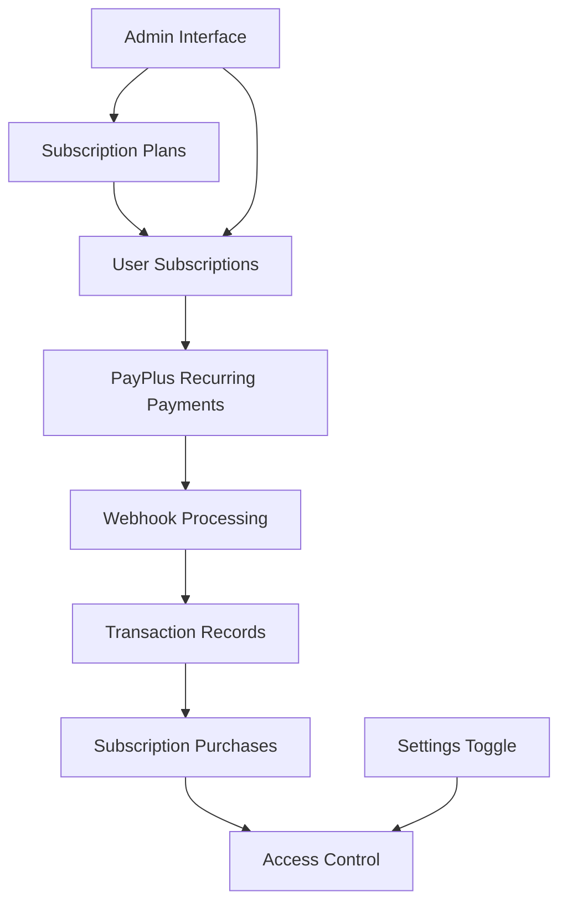
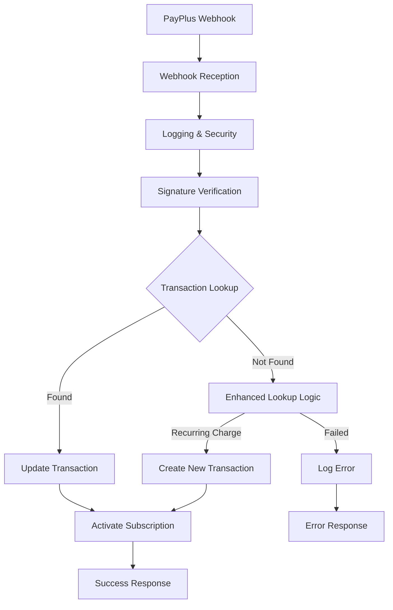

# Ludora Subscription System - Comprehensive Guide

> **Complete guide for subscription implementation, testing, and maintenance**

## Table of Contents

1. [System Overview](#system-overview)
2. [Architecture & Components](#architecture--components)
3. [Development Setup](#development-setup)
4. [Testing Strategies](#testing-strategies)
5. [Webhook Integration](#webhook-integration)
6. [Payment Processing](#payment-processing)
7. [Troubleshooting](#troubleshooting)
8. [Monitoring & Analytics](#monitoring--analytics)
9. [Production Deployment](#production-deployment)

---

## System Overview

The Ludora Subscription System provides **flexible recurring payment management** with Israeli payment processor (PayPlus) integration, comprehensive allowance tracking, and admin control features.

### Key Features

- **Flexible Billing Cycles**: Daily, monthly, yearly with admin overrides
- **Rich Benefits System**: JSONB-based benefits with unlimited/limited allowances
- **PayPlus Integration**: Recurring payments with webhook processing
- **Admin Controls**: Global system toggle, plan management, discount control
- **Allowance Tracking**: SubscriptionPurchase model for usage analytics
- **Israeli Compliance**: Hebrew RTL support and Israeli privacy compliance

### System Components



---

## Architecture & Components

### 1. Data Models

#### SubscriptionPlan
```javascript
{
  id: 'plan_123abc',
  name: 'Premium Plan',
  price: 99.90,                    // Base price
  billing_period: 'monthly',       // daily|monthly|yearly
  has_discount: true,
  discount_value: 20,              // Percentage or fixed amount
  is_active: true,
  plan_type: 'pro',               // free|pro
  benefits: {
    games_access: {
      enabled: true,
      unlimited: false,
      monthly_limit: 50
    },
    files_access: {
      enabled: true,
      unlimited: true
    },
    lesson_plans_access: {
      enabled: true,
      unlimited: false,
      monthly_limit: 30
    },
    classroom_management: {
      enabled: true,
      unlimited_classrooms: false,
      max_classrooms: 10,
      max_total_students: 500
    },
    reports_access: true
  }
}
```

#### Subscription
```javascript
{
  id: 'sub_456def',
  user_id: 'user_789ghi',
  subscription_plan_id: 'plan_123abc',
  status: 'active',               // pending|active|cancelled|expired
  billing_price: 79.90,          // Admin-overridden price
  next_billing_date: '2025-12-11T00:00:00Z',
  end_date: null,                 // For fixed-term subscriptions
  payplus_subscription_uid: 'sub_payplus_123',
  metadata: {
    admin_override: true,
    discount_applied: 20,
    test_mode: false
  }
}
```

#### SubscriptionPurchase (Allowance Tracking)
```javascript
{
  id: 'subpurch_111aaa',
  subscription_history_id: 'sub_456def',
  purchasable_type: 'workshop',
  purchasable_id: 'ws_789xyz',
  usage_tracking: {
    monthly_claims: 1,
    total_usage: 5,
    last_accessed: '2025-12-11T10:30:00Z',
    custom_metadata: {
      source: 'subscription_claim'
    }
  }
}
```

### 2. Service Layer

#### SubscriptionService
```javascript
// Core subscription lifecycle management
class SubscriptionService {
  async createSubscription(options) {
    // Creates subscription with PayPlus integration
    // Handles admin price overrides and custom billing dates
  }

  async claimProduct(userId, productType, productId) {
    // Claims product using subscription allowance
    // Creates SubscriptionPurchase record for tracking
  }

  async checkBenefits(userId) {
    // Returns available subscription benefits
    // Includes usage tracking and limits
  }
}
```

#### SubscriptionPaymentStatusService
```javascript
// Automatic abandoned payment detection and handling
class SubscriptionPaymentStatusService {
  async checkAndHandleSubscriptionPaymentPageStatus(subscriptionId, options) {
    // Detects abandoned payment pages
    // Handles completed/failed payments
    // Supports renewal detection via subscription UID
  }

  async checkUserPendingSubscriptions(userId) {
    // Bulk check for user's pending subscriptions
    // Returns summary of activated/cancelled subscriptions
  }
}
```

### 3. Admin Interface Features

- **Global subscription system toggle** (enable/disable entire system)
- **Plan creation** with rich benefit configuration
- **Discount management** (percentage or fixed amount)
- **Plan duplication** for quick variations
- **Billing period configuration** (daily/monthly/yearly)
- **Visual benefit indicators** with unlimited options
- **Hebrew RTL support** throughout admin interface

---

## Development Setup

### 1. Environment Configuration

```bash
# .env.development - Subscription settings
PAYPLUS_API_KEY=your_staging_api_key
PAYPLUS_SECRET_KEY=your_staging_secret_key
PAYPLUS_MODE=staging
PAYPLUS_WEBHOOK_URL=http://localhost:3003/api/webhooks/payplus

# For webhook testing with ngrok
npm install -g ngrok
ngrok http 3003
# Update webhook URL: https://abc123.ngrok.io/api/webhooks/payplus
```

### 2. Database Setup

```sql
-- Create subscription plans
INSERT INTO subscriptionplan (id, name, price, billing_period, benefits, is_active)
VALUES (
  'plan_dev_basic',
  'Development Basic',
  29.90,
  'monthly',
  '{"games_access":{"enabled":true,"unlimited":false,"monthly_limit":10}}',
  true
);

-- Check existing plans
SELECT id, name, price, billing_period, is_active
FROM subscriptionplan
WHERE is_active = true;
```

### 3. Test User Setup

```sql
-- Find test users
SELECT id, email, displayName FROM "user" LIMIT 5;

-- Create test subscription
-- Use SubscriptionService.createSubscription() or API endpoint
```

---

## Testing Strategies

### 1. Daily Subscription Testing

**Purpose**: Test recurring payment webhooks in 24 hours instead of waiting a month.

#### Quick Setup (5 Steps)

```bash
# 1. Enable daily testing mode
export ENABLE_DAILY_SUBSCRIPTION_TESTING=true

# 2. Find test user and plan
node -e "
const models = require('./models');
models.User.findAll({limit: 3}).then(users =>
  console.log('Users:', users.map(u => ({id: u.id, email: u.email})))
);
"

# 3. Preview subscription (dry run)
ENABLE_DAILY_SUBSCRIPTION_TESTING=true node scripts/testDailySubscription.js \
  --userId=user_abc123 \
  --planId=plan_monthly_basic \
  --dryRun

# 4. Create test subscription
ENABLE_DAILY_SUBSCRIPTION_TESTING=true node scripts/testDailySubscription.js \
  --userId=user_abc123 \
  --planId=plan_monthly_basic

# 5. Complete payment and monitor webhooks
```

#### Testing Timeline

| Time | Event | What to Check |
|------|-------|---------------|
| **Day 1, Now** | Create subscription | Script completes, payment URL generated |
| **Day 1, +5 min** | Complete payment | PayPlus payment page, use test card |
| **Day 1, +10 min** | First payment webhook | Check webhooklog table, status = 'completed' |
| **Day 1, +15 min** | Subscription activated | subscription.status = 'active' |
| **Day 2, +24h** | First recurring charge | Second webhook arrives - KEY TEST |
| **Day 2, +24h +10 min** | Analyze webhook payload | Compare first vs recurring webhook structure |

### 2. PayPlus Test Cards (Staging)

| Card Number | Expiry | CVV | Result |
|-------------|--------|-----|--------|
| 4580458045804580 | 12/25 | 123 | Success |
| 4111111111111111 | 12/25 | 123 | Success |
| 5555555555554444 | 12/25 | 123 | Success |

### 3. Monitoring Commands

```sql
-- Check webhook logs
SELECT
  id, created_at, event_type, status,
  event_data->>'subscription_uid' as subscription_uid,
  event_data->'transaction'->>'payment_page_request_uid' as page_request_uid
FROM webhooklog
WHERE subscription_id = 'YOUR_SUBSCRIPTION_ID'
ORDER BY created_at DESC;

-- Check subscription status
SELECT id, status, payplus_subscription_uid, created_at, metadata
FROM subscription
WHERE id = 'YOUR_SUBSCRIPTION_ID';

-- Monitor real-time webhooks
tail -f logs/production.log | grep "SUBSCRIPTION WEBHOOK"
```

### 4. Cleanup After Testing

```bash
# Disable daily testing
export ENABLE_DAILY_SUBSCRIPTION_TESTING=false

# Cancel test subscriptions
UPDATE subscription
SET status = 'cancelled'
WHERE metadata->>'test_mode' = 'daily_subscription_testing';

# Cancel in PayPlus dashboard
# Navigate to staging.payplus.co.il -> Subscriptions -> Cancel manually
```

---

## Webhook Integration

### 1. Webhook Processing Flow



### 2. Enhanced Transaction Lookup

**Problem**: Recurring charge webhooks may not contain the original `payment_page_request_uid`.

**Solution**: Multi-method lookup with fallbacks.

```javascript
async function getOrCreateTransaction(webhookData) {
  // ATTEMPT 1: Standard lookup by payment_page_request_uid (first payments)
  if (webhookData.transaction?.payment_page_request_uid) {
    const transaction = await models.Transaction.findOne({
      where: { payment_page_request_uid: webhookData.transaction.payment_page_request_uid }
    });
    if (transaction) {
      return { transaction, method: 'payment_page_request_uid' };
    }
  }

  // ATTEMPT 2: Lookup by subscription_uid + custom_fields (recurring charges)
  if (webhookData.subscription_uid && webhookData.custom_fields?.subscription_id) {
    const subscription = await models.Subscription.findOne({
      where: {
        id: webhookData.custom_fields.subscription_id,
        payplus_subscription_uid: webhookData.subscription_uid
      }
    });

    if (subscription) {
      // Create new transaction for recurring charge
      const transaction = await models.Transaction.create({
        id: generateId(),
        user_id: subscription.user_id,
        amount: webhookData.amount || subscription.billing_price,
        payment_status: 'pending',
        metadata: {
          subscription_id: subscription.id,
          transaction_type: 'subscription_recurring_charge',
          charge_number: webhookData.charge_number || null,
          payplus_transaction_uid: webhookData.transaction_uid,
          payplus_subscription_uid: webhookData.subscription_uid
        }
      });

      return { transaction, method: 'recurring_charge_creation' };
    }
  }

  // ATTEMPT 3: Lookup by transaction_uid
  if (webhookData.transaction_uid) {
    const transaction = await models.Transaction.findOne({
      where: { 'metadata.payplus_transaction_uid': webhookData.transaction_uid }
    });
    if (transaction) {
      return { transaction, method: 'transaction_uid' };
    }
  }

  throw new Error('Unable to find or create transaction for webhook');
}
```

### 3. Webhook Payload Analysis

The webhook handler includes comprehensive logging to capture recurring charge payload structure:

```javascript
// Enhanced logging for subscription webhooks
if (isSubscriptionTransaction) {
  ludlog.payments.prod('📊 SUBSCRIPTION WEBHOOK PAYLOAD ANALYSIS:', {
    webhookId: webhookLog.id,
    subscriptionId,
    analysis: {
      hasSubscriptionUid: !!webhookData.subscription_uid,
      subscriptionUid: webhookData.subscription_uid,
      hasCustomFields: !!webhookData.custom_fields,
      customFields: webhookData.custom_fields,
      hasPaymentPageRequestUid: !!webhookData.transaction?.payment_page_request_uid,
      paymentPageRequestUid: webhookData.transaction?.payment_page_request_uid,
      statusCode: webhookData.transaction?.status_code,
      recurringInfo: webhookData.recurring_info || null,
      chargeNumber: webhookData.charge_number || null
    },
    fullWebhookData: webhookData
  });
}
```

---

## Payment Processing

### 1. Subscription Creation Flow

```javascript
// API endpoint: POST /api/subscriptions/create
async function createSubscription(req, res) {
  try {
    // Validate subscription plan and user
    const plan = await models.SubscriptionPlan.findByPk(req.body.planId);
    const user = await models.User.findByPk(req.user.id);

    // Create subscription record
    const subscription = await models.Subscription.create({
      id: generateId(),
      user_id: user.id,
      subscription_plan_id: plan.id,
      status: 'pending',
      billing_price: req.body.adminPrice || plan.price, // Admin override
      next_billing_date: calculateNextBillingDate(plan.billing_period),
      metadata: {
        admin_override: !!req.body.adminPrice,
        test_mode: process.env.ENABLE_DAILY_SUBSCRIPTION_TESTING === 'true'
      }
    });

    // Create PayPlus payment page
    const paymentPageData = await PayPlusService.createSubscriptionPaymentPage({
      amount: subscription.billing_price,
      billing_period: plan.billing_period,
      custom_fields: {
        subscription_id: subscription.id,
        subscription_plan_id: plan.id
      },
      webhook_url: process.env.PAYPLUS_WEBHOOK_URL
    });

    // Update subscription with PayPlus data
    await subscription.update({
      payplus_payment_page_uid: paymentPageData.data.page_request_uid,
      metadata: {
        ...subscription.metadata,
        payplus_data: paymentPageData
      }
    });

    res.json({
      subscription,
      payment_url: paymentPageData.data.payment_page_url
    });

  } catch (error) {
    res.status(500).json({ error: error.message });
  }
}
```

### 2. Subscription Benefits API

```javascript
// API endpoint: GET /api/subscriptions/user/benefits
async function getUserBenefits(req, res) {
  try {
    const activeSubscription = await models.Subscription.findOne({
      where: {
        user_id: req.user.id,
        status: 'active'
      },
      include: [{
        model: models.SubscriptionPlan,
        as: 'plan'
      }]
    });

    if (!activeSubscription) {
      return res.json({
        hasSubscription: false,
        benefits: {}
      });
    }

    // Calculate current usage
    const currentMonth = new Date().toISOString().slice(0, 7); // YYYY-MM
    const usage = await models.SubscriptionPurchase.findAll({
      where: {
        subscription_history_id: activeSubscription.id,
        created_at: {
          [Op.gte]: new Date(currentMonth + '-01')
        }
      }
    });

    // Group usage by product type
    const usageByType = usage.reduce((acc, purchase) => {
      acc[purchase.purchasable_type] = (acc[purchase.purchasable_type] || 0) + 1;
      return acc;
    }, {});

    // Format benefits response
    const benefits = {};
    const planBenefits = activeSubscription.plan.benefits;

    for (const [benefit, config] of Object.entries(planBenefits)) {
      benefits[benefit] = {
        enabled: config.enabled,
        unlimited: config.unlimited,
        limit: config.monthly_limit || config.limit,
        used: usageByType[benefit] || 0,
        remaining: config.unlimited ?
          'unlimited' :
          Math.max(0, (config.monthly_limit || config.limit) - (usageByType[benefit] || 0))
      };
    }

    res.json({
      hasSubscription: true,
      subscription: {
        id: activeSubscription.id,
        plan_name: activeSubscription.plan.name,
        status: activeSubscription.status,
        next_billing_date: activeSubscription.next_billing_date
      },
      benefits,
      usage: usageByType
    });

  } catch (error) {
    res.status(500).json({ error: error.message });
  }
}
```

---

## Troubleshooting

### Common Issues

#### 1. "Cannot run daily subscription testing in production!"

**Cause**: `NODE_ENV` is set to `production`
**Solution**:
```bash
echo $NODE_ENV  # Should be 'staging' or 'development'
export NODE_ENV=staging
```

#### 2. "ENABLE_DAILY_SUBSCRIPTION_TESTING must be set to true"

**Cause**: Environment variable not set
**Solution**:
```bash
export ENABLE_DAILY_SUBSCRIPTION_TESTING=true
```

#### 3. Webhook didn't arrive after payment

**Checks**:
1. Verify webhook URL configured in PayPlus dashboard
2. Check server accessibility from PayPlus servers (use ngrok for local testing)
3. Review WebhookLog table for received webhooks
4. Check firewall/security settings

```sql
-- Check recent webhooks
SELECT id, created_at, event_type, status, process_log
FROM webhooklog
WHERE created_at > NOW() - INTERVAL '1 hour'
ORDER BY created_at DESC;
```

#### 4. Recurring webhook processing fails

**Common causes**:
- Missing `payment_page_request_uid` in recurring webhooks
- Different webhook structure for recurring vs first payments
- Signature validation differences

**Debug approach**:
```sql
-- Analyze webhook payload differences
SELECT
  id,
  event_data->>'subscription_uid' as sub_uid,
  event_data->'transaction'->>'payment_page_request_uid' as page_uid,
  event_data->>'charge_number' as charge_num,
  status,
  process_log
FROM webhooklog
WHERE subscription_id = 'YOUR_SUB_ID'
ORDER BY created_at ASC;
```

#### 5. Subscription benefits not working

**Check**:
1. Subscription status is 'active'
2. Plan benefits are properly configured
3. SubscriptionPurchase records are created correctly

```sql
-- Debug subscription benefits
SELECT
  s.id,
  s.status,
  sp.name as plan_name,
  sp.benefits,
  COUNT(spu.id) as usage_count
FROM subscription s
JOIN subscriptionplan sp ON s.subscription_plan_id = sp.id
LEFT JOIN subscriptionpurchase spu ON spu.subscription_history_id = s.id
WHERE s.user_id = 'USER_ID'
GROUP BY s.id, s.status, sp.name, sp.benefits;
```

---

## Monitoring & Analytics

### 1. Key Metrics

#### Subscription Health
```sql
-- Subscription status distribution
SELECT
  status,
  COUNT(*) as count,
  COUNT(*) * 100.0 / SUM(COUNT(*)) OVER () as percentage
FROM subscription
WHERE created_at > NOW() - INTERVAL '30 days'
GROUP BY status;
```

#### Webhook Processing Success Rate
```sql
SELECT
  DATE(created_at) as date,
  COUNT(*) as total_webhooks,
  SUM(CASE WHEN status = 'completed' THEN 1 ELSE 0 END) as successful,
  SUM(CASE WHEN status = 'completed' THEN 1 ELSE 0 END) * 100.0 / COUNT(*) as success_rate
FROM webhooklog
WHERE provider = 'payplus'
  AND created_at > NOW() - INTERVAL '7 days'
GROUP BY DATE(created_at)
ORDER BY date DESC;
```

#### Revenue Metrics
```sql
-- Monthly recurring revenue
SELECT
  DATE_TRUNC('month', created_at) as month,
  COUNT(*) as subscriptions,
  SUM(billing_price) as monthly_revenue,
  AVG(billing_price) as avg_subscription_value
FROM subscription
WHERE status = 'active'
  AND created_at > NOW() - INTERVAL '12 months'
GROUP BY DATE_TRUNC('month', created_at)
ORDER BY month DESC;
```

### 2. Alerting

#### Critical Alerts
1. **Webhook Processing Failure Rate > 5%**
2. **Multiple Signature Validation Failures**
3. **PayPlus API Connection Failures**
4. **Daily Testing Mode Active in Production**

#### Warning Alerts
1. **Subscription Creation Failure Rate > 10%**
2. **Recurring Charge Processing Delays**
3. **Benefit Claims Approaching Limits**

---

## Production Deployment

### 1. Pre-Deployment Checklist

- [ ] **Environment Variables**: All production PayPlus credentials configured
- [ ] **Webhook URLs**: Production webhook URLs configured in PayPlus dashboard
- [ ] **Database Migration**: All subscription-related tables migrated
- [ ] **Daily Testing Disabled**: `ENABLE_DAILY_SUBSCRIPTION_TESTING=false`
- [ ] **Monitoring Setup**: Alerts configured for webhook failures
- [ ] **Security Review**: Webhook signature validation tested

### 2. Deployment Steps

```bash
# 1. Deploy to staging first
git checkout main
git pull origin main

# 2. Run tests
npm test

# 3. Check linting
npm run lint

# 4. Deploy to staging
# Follow your deployment process

# 5. Test staging with real PayPlus staging
curl -X POST https://staging-api.ludora.app/api/subscriptions/create

# 6. Monitor staging for 24-48 hours

# 7. Deploy to production
# Follow your production deployment process
```

### 3. Post-Deployment Monitoring

**First Week**:
- Monitor webhook processing success rate (should be >99%)
- Check subscription creation success rate
- Verify PayPlus integration stability
- Monitor for any error patterns

**First Month**:
- Analyze first batch of recurring charges
- Review revenue metrics accuracy
- Check subscription lifecycle management
- Validate benefit usage tracking

### 4. Rollback Plan

If critical issues arise:

1. **Immediate**: Disable subscription creation endpoint
2. **Quick**: Rollback to previous version
3. **Emergency**: Set emergency maintenance mode

```bash
# Emergency subscription system disable
UPDATE settings
SET value = 'false'
WHERE key = 'subscription_system_enabled';
```

---

## Quick Reference

### Environment Setup
```bash
export ENABLE_DAILY_SUBSCRIPTION_TESTING=true
export PAYPLUS_WEBHOOK_URL=https://your-domain.com/api/webhooks/payplus
```

### Create Test Subscription
```bash
node scripts/testDailySubscription.js --userId=USER_ID --planId=PLAN_ID
```

### Monitor Webhooks
```sql
SELECT * FROM webhooklog
WHERE subscription_id = 'SUB_ID'
ORDER BY created_at DESC;
```

### Check Subscription Status
```sql
SELECT id, status, billing_price, next_billing_date
FROM subscription
WHERE user_id = 'USER_ID';
```

---

**Ready to implement?** Start with the [Development Setup](#development-setup) section and follow the testing guide for a complete walkthrough.

---

*This guide consolidates content from multiple subscription documentation files. For specific technical details, see individual implementation files in `/services/` and `/routes/`.*