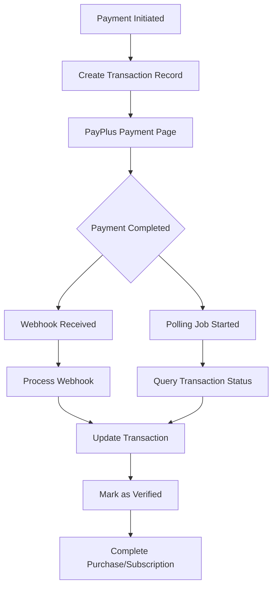
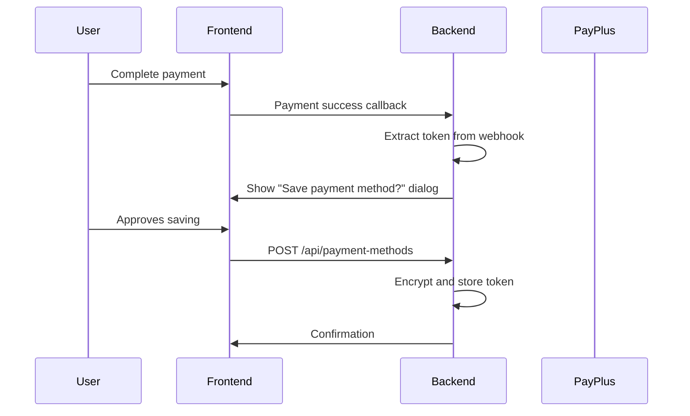

# PayPlus Payment Improvements - Investigation Report

## Executive Summary

This report provides a comprehensive analysis of the current PayPlus integration and recommendations for implementing payment method management and dual verification strategies. The investigation reveals that while webhooks are implemented, there's no polling mechanism, and payment tokens are being requested but not stored or utilized.

## 1. PayPlus API Documentation Summary

### Available Endpoints

Based on the PayPlus API documentation research:

#### Transaction Management
- **Transactions History**: `POST /api/v1.0/TransactionReports/TransactionsHistory`
- **Charge by Transaction UID**: `POST /api/v1.0/Transactions/ChargeByTransactionUID`
- **Transaction Status**: Can be queried using transaction_uid from webhook data

#### Key Capabilities
1. **Webhook Callbacks**: Supported via `refURL_callback` parameter
2. **Transaction Polling**: Available through TransactionsHistory endpoint
3. **Payment Tokens**: Created via `create_token: true` setting
4. **Recurring Payments**: Supported for subscriptions

### API Limitations
- No real-time status polling endpoint documented
- Token usage requires additional API calls
- Rate limits not clearly documented

## 2. Current State Analysis

### Webhook Implementation Status

#### Strengths
1. **Comprehensive webhook handler** at `/api/webhooks/payplus`
2. **Detailed logging** in WebhookLog table with process tracking
3. **Transaction status mapping** from PayPlus codes to internal statuses
4. **Support for both purchases and subscriptions**

#### Weaknesses
1. **No signature verification** (commented as TODO)
2. **No retry mechanism** for failed webhook processing
3. **No polling fallback** if webhooks fail
4. **Silent failures** - errors logged but not retried

### Current Token Implementation

```javascript
// In PayplusService.js line 301:
settings.create_token = true;
```

**Finding**: Tokens are being requested from PayPlus but:
- Not captured from webhook responses
- Not stored in database
- Not available for future transactions

### Database Analysis

#### Current State
- No payment token storage in User table
- No PaymentMethod table exists
- Transaction table has basic payment info but no token fields
- WebhookLog captures raw data but doesn't extract tokens

## 3. Dual Payment Verification Strategy Design

### Architecture Overview



### Implementation Components

#### 1. Webhook Handler (Existing - Enhance)
```javascript
// Enhanced webhook processing
async function processWebhook(webhookData) {
  // 1. Verify signature
  // 2. Extract payment token if present
  // 3. Update transaction
  // 4. Cancel any pending polling jobs
  // 5. Mark as webhook-verified
}
```

#### 2. Polling Service (New)
```javascript
class PaymentPollingService {
  // Poll for transactions pending > 5 minutes
  async pollPendingTransactions() {
    // Query PayPlus API for status
    // Update transaction records
    // Mark as polling-verified
  }

  // Schedule periodic checks
  startPollingJob() {
    // Run every 2 minutes
    // Check transactions pending 5-30 minutes
  }
}
```

#### 3. Verification Status Tracking
```sql
ALTER TABLE transaction ADD COLUMN verification_method VARCHAR(20);
-- Values: 'webhook', 'polling', 'manual', null
ALTER TABLE transaction ADD COLUMN verification_attempts INTEGER DEFAULT 0;
ALTER TABLE transaction ADD COLUMN last_poll_at TIMESTAMP;
```

### First-Wins Logic
1. Both webhook and polling can update transaction
2. First successful verification wins
3. Subsequent verifications are logged but don't re-process

## 4. Payment Method Management System

### Database Schema Design

```sql
-- New table for storing payment methods
CREATE TABLE payment_methods (
  id VARCHAR(255) PRIMARY KEY,
  user_id VARCHAR(255) NOT NULL REFERENCES users(id),
  payplus_token VARCHAR(255) NOT NULL,
  payment_type VARCHAR(50) NOT NULL, -- 'credit_card', 'bank_transfer'

  -- Card details (masked)
  card_last_four VARCHAR(4),
  card_brand VARCHAR(50), -- 'visa', 'mastercard', 'amex'
  card_expiry_month INTEGER,
  card_expiry_year INTEGER,
  card_holder_name VARCHAR(255),

  -- Metadata
  is_default BOOLEAN DEFAULT FALSE,
  is_active BOOLEAN DEFAULT TRUE,
  created_at TIMESTAMP DEFAULT NOW(),
  updated_at TIMESTAMP DEFAULT NOW(),
  last_used_at TIMESTAMP,

  -- Security
  token_encrypted TEXT, -- Encrypted token storage
  encryption_key_version INTEGER DEFAULT 1,

  CONSTRAINT fk_payment_method_user FOREIGN KEY (user_id) REFERENCES users(id),
  INDEX idx_payment_method_user (user_id),
  INDEX idx_payment_method_default (user_id, is_default)
);

-- User consent tracking
CREATE TABLE payment_method_consents (
  id VARCHAR(255) PRIMARY KEY,
  user_id VARCHAR(255) NOT NULL,
  payment_method_id VARCHAR(255) NOT NULL,
  consent_type VARCHAR(50) NOT NULL, -- 'save_card', 'recurring_charge'
  consent_given BOOLEAN NOT NULL,
  consent_timestamp TIMESTAMP DEFAULT NOW(),
  ip_address VARCHAR(45),
  user_agent TEXT,

  CONSTRAINT fk_consent_user FOREIGN KEY (user_id) REFERENCES users(id),
  CONSTRAINT fk_consent_method FOREIGN KEY (payment_method_id) REFERENCES payment_methods(id),
  INDEX idx_consent_user (user_id)
);
```

### API Endpoints Design

#### Payment Method CRUD Operations

```javascript
// GET /api/payment-methods
// List user's saved payment methods
{
  response: [
    {
      id: "pm_123",
      type: "credit_card",
      brand: "visa",
      last_four: "4242",
      expiry: "12/2025",
      is_default: true
    }
  ]
}

// POST /api/payment-methods
// Save a new payment method (after successful payment)
{
  request: {
    payplus_token: "token_xyz",
    consent_to_save: true,
    set_as_default: false
  }
}

// PUT /api/payment-methods/:id/default
// Set as default payment method

// DELETE /api/payment-methods/:id
// Remove a saved payment method

// POST /api/payment-methods/:id/charge
// Charge a saved payment method
{
  request: {
    amount: 99.00,
    purchase_items: [...]
  }
}
```

## 5. Security Considerations

### Token Storage Security

1. **Encryption at Rest**
   - Use AES-256 encryption for token storage
   - Store encryption keys in environment variables
   - Implement key rotation strategy

2. **Access Control**
   - Users can only access their own payment methods
   - Admin override with audit logging
   - Rate limiting on payment method operations

3. **PCI Compliance**
   - Never store full card numbers
   - Only store PayPlus tokens and masked card info
   - Implement secure token transmission

### Implementation Code
```javascript
class PaymentMethodSecurity {
  // Encrypt token before storage
  encryptToken(token) {
    const cipher = crypto.createCipher('aes-256-gcm', process.env.PAYMENT_TOKEN_KEY);
    return cipher.update(token, 'utf8', 'hex') + cipher.final('hex');
  }

  // Decrypt token for use
  decryptToken(encryptedToken) {
    const decipher = crypto.createDecipher('aes-256-gcm', process.env.PAYMENT_TOKEN_KEY);
    return decipher.update(encryptedToken, 'hex', 'utf8') + decipher.final('utf8');
  }
}
```

## 6. User Experience Flow

### Saving Payment Method Flow



### Using Saved Payment Method

1. **Checkout Page**
   - Display saved payment methods
   - Option to use saved or enter new
   - Default method pre-selected

2. **One-Click Purchase**
   - Select saved payment method
   - Confirm amount
   - Process payment using token

3. **Management Page**
   - View all saved methods
   - Set/change default
   - Remove methods
   - Add new methods

## 7. Implementation Timeline

### Phase 1: Foundation (Week 1)
- [ ] Implement payment polling service
- [ ] Add signature verification to webhooks
- [ ] Create dual verification logic
- [ ] Add verification tracking fields

### Phase 2: Token Capture (Week 2)
- [ ] Extract tokens from webhook data
- [ ] Create payment_methods table
- [ ] Implement token encryption
- [ ] Build consent tracking

### Phase 3: API Development (Week 3)
- [ ] Payment method CRUD endpoints
- [ ] Security middleware
- [ ] Rate limiting
- [ ] Testing suite

### Phase 4: Frontend Integration (Week 4)
- [ ] Payment method UI components
- [ ] Checkout flow integration
- [ ] Management page
- [ ] User consent dialogs

### Phase 5: Testing & Launch (Week 5)
- [ ] Security audit
- [ ] Load testing
- [ ] User acceptance testing
- [ ] Production rollout

## 8. Risk Assessment

### High Priority Risks
1. **Token Security Breach** - Mitigated by encryption
2. **Webhook Failures** - Mitigated by polling fallback
3. **Duplicate Charges** - Mitigated by idempotency

### Medium Priority Risks
1. **API Rate Limits** - Implement backoff strategy
2. **User Confusion** - Clear UI/UX design
3. **Performance Impact** - Optimize polling queries

## 9. Recommendations

### Immediate Actions
1. **Implement webhook signature verification** (Security critical)
2. **Add basic polling for failed webhooks** (Reliability)
3. **Start capturing payment tokens** (Foundation for saved methods)

### Short Term (1-2 weeks)
1. **Build payment method storage system**
2. **Create management API endpoints**
3. **Implement encryption for tokens**

### Medium Term (3-4 weeks)
1. **Full frontend integration**
2. **User consent workflows**
3. **Testing and optimization**

## 10. Code Examples

### Webhook Token Extraction
```javascript
// In webhook handler
if (webhookData.transaction?.token) {
  const paymentToken = {
    payplus_token: webhookData.transaction.token,
    card_last_four: webhookData.transaction.card_last_four,
    card_brand: webhookData.transaction.card_brand,
    // ... other fields
  };

  await savePaymentMethod(userId, paymentToken);
}
```

### Polling Implementation
```javascript
async function pollTransactionStatus(transactionUid) {
  const response = await fetch(`${PAYPLUS_API_URL}/TransactionReports/TransactionsHistory`, {
    method: 'POST',
    headers: {
      'api-key': process.env.PAYPLUS_API_KEY,
      'secret-key': process.env.PAYPLUS_SECRET_KEY
    },
    body: JSON.stringify({
      transaction_uid: transactionUid
    })
  });

  return response.json();
}
```

## Conclusion

The current PayPlus integration has a solid foundation but lacks critical features for modern payment processing. Implementing the dual verification strategy and payment method management system will significantly improve:

1. **Reliability** through redundant verification
2. **User Experience** through saved payment methods
3. **Security** through proper token management
4. **Business Value** through reduced checkout friction

The phased implementation approach allows for incremental delivery while maintaining system stability.